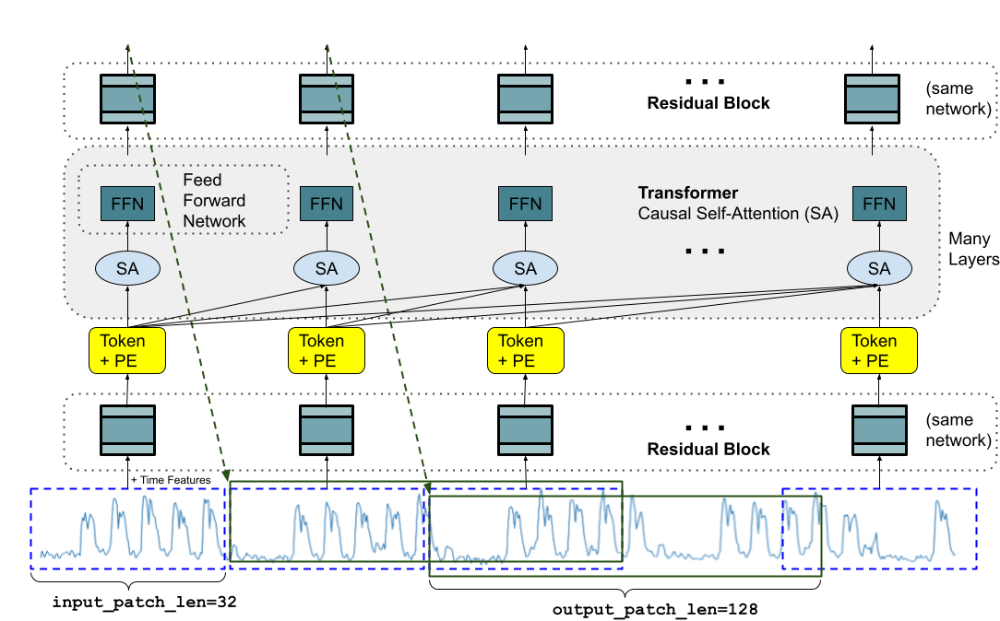

# TimesFM



TimesFM (Time Series Foundation Model) is a single foundation model for time-series forecasting developed by Google Research. It consists of decoders of [transformers](https://arxiv.org/abs/1706.03762) with input patching, which enables efficient training on time-series corputs. The model trained on a large-scale time-series corpus, which consists of both real-world time-series data and synthetic data. Google has released the weight of 200M model on HuggingFace and the training code on GitHub, so that anybody can freely finetune the model on their own dataset.

## Run Locally

If you have cloned this repository with `git clone` withtout `--recursive` , you have to run `git submodule update` to get the `timesfm` module properly.

Because the dependencies of timesfm module does not fully covered the finetuning scenario, you have to run the script to update the dependency list of the module.

```sh
python update_dep.py
```

After that, you can finetune the TimesFM model.

```sh
python finetune.py
```
