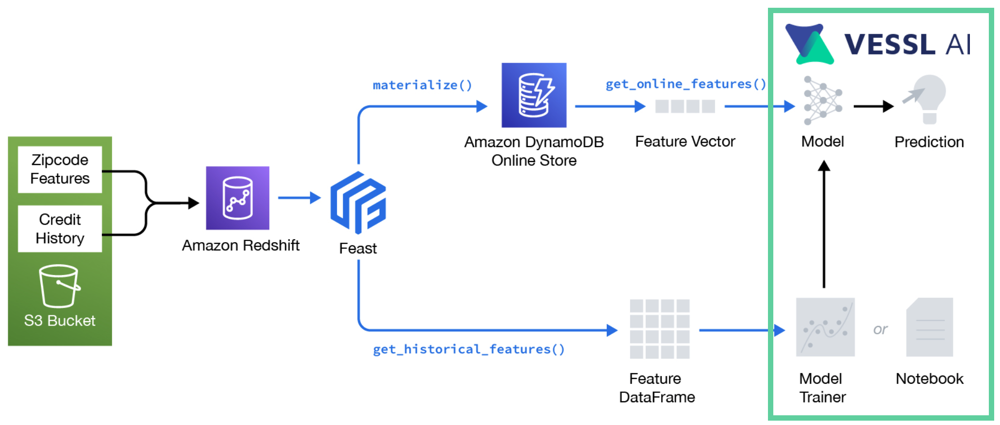
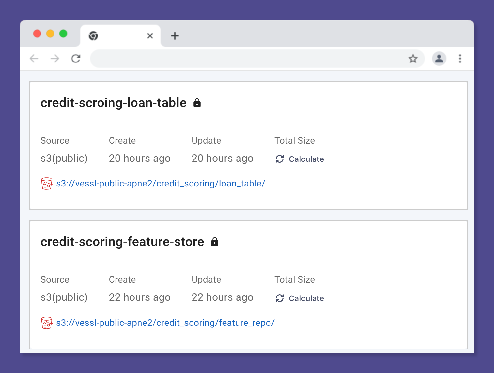
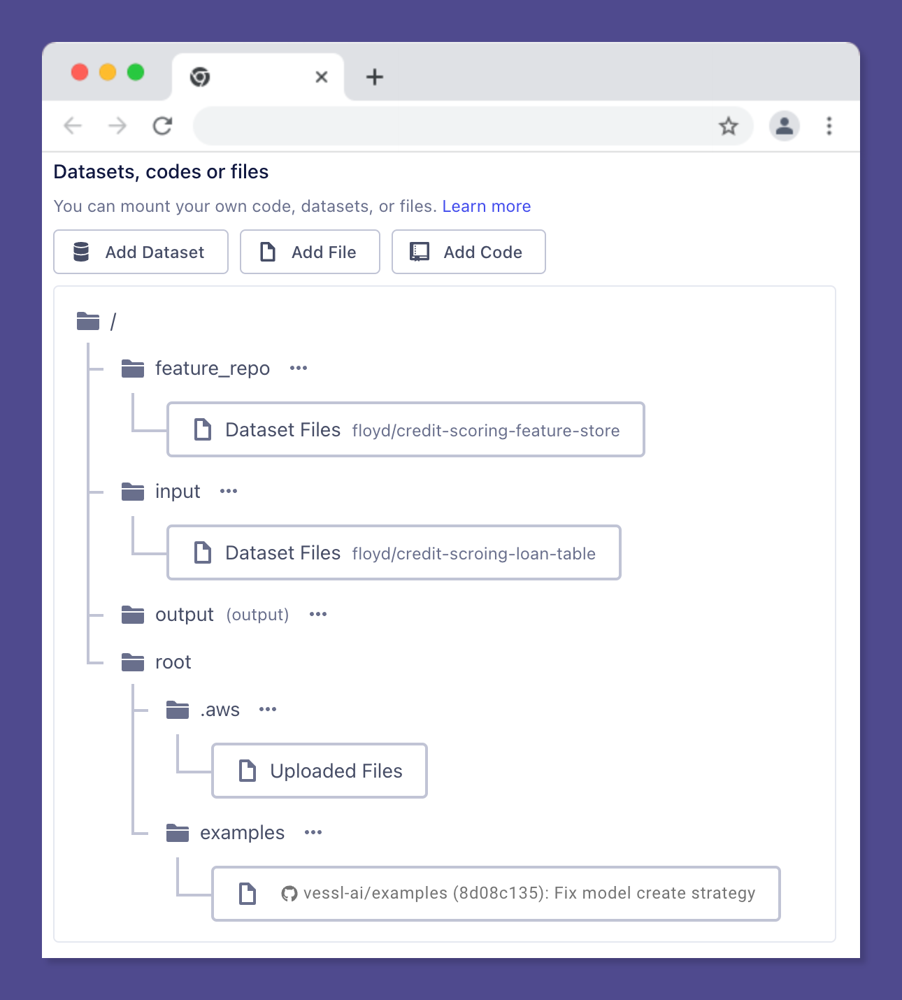
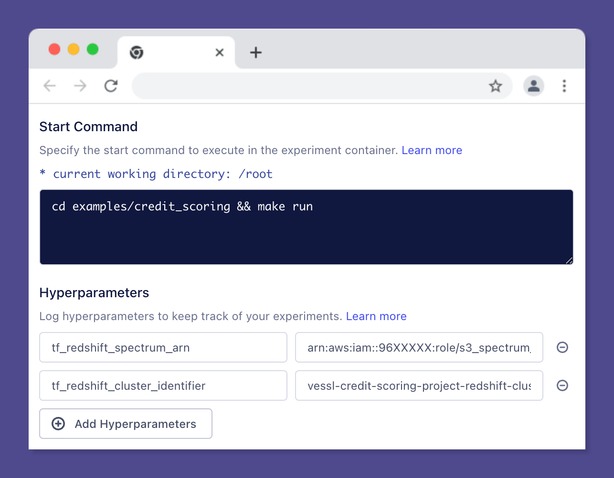
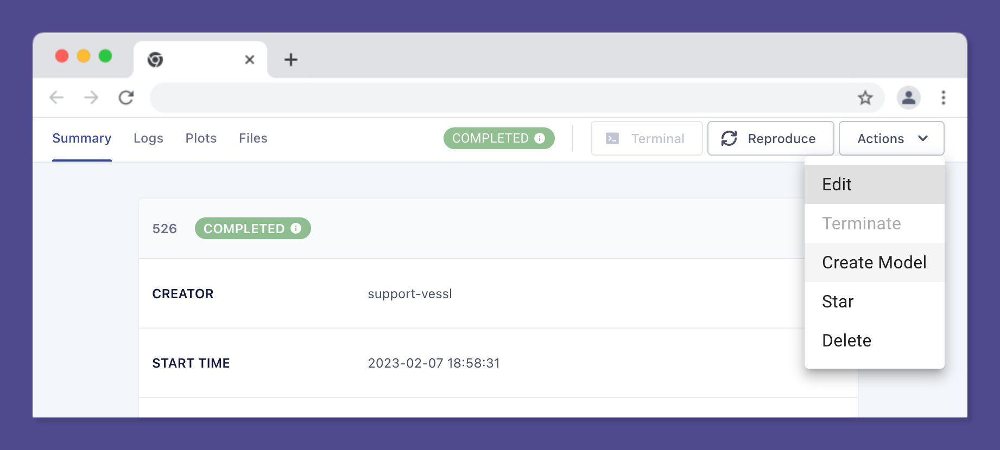
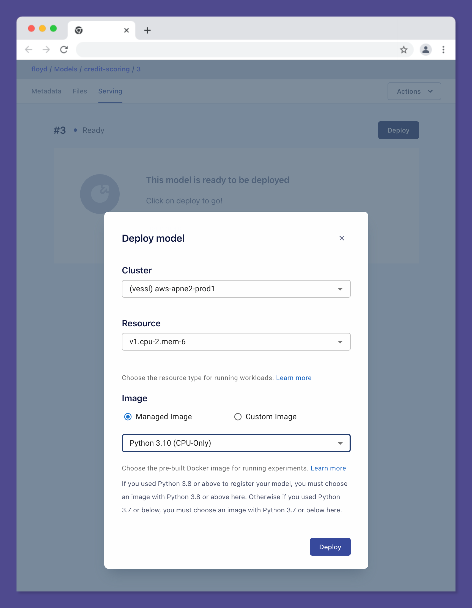
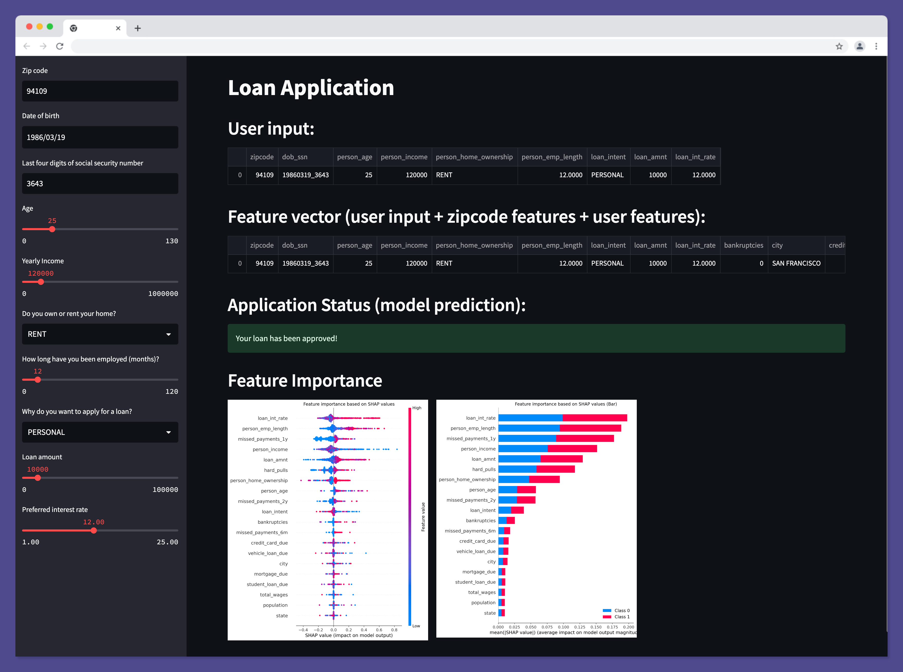
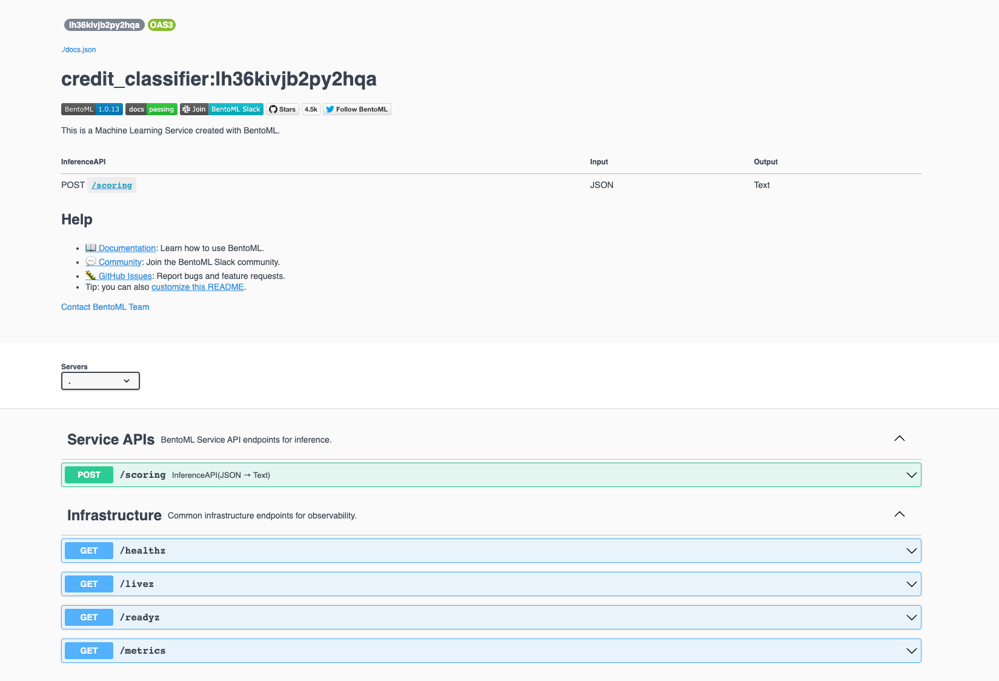

# Real-time Credit Scoring with Feast on AWS

## Summary
- This example is modified from [feast-dev/feast-aws-credit-scoring-tutorial](https://github.com/feast-dev/feast-aws-credit-scoring-tutorial) for a better understanding of how to use Feast with [VESSL](http://vessl.ai/).



## Requirements
- Terraform (v1.0 or later)
- AWS CLI (v2.2 or later)
  - Your aws credentials should be set in `~/.aws/credentials`.
- Parquet files in S3 ([s3://vessl-public-apne2/credit_scoring/](s3://vessl-public-apne2/credit_scoring/))
  ```
    credit_scoring/
      ├── source_data/
      │      ├── credit_history/
      │      │      └── table.parquet
      │      └── zipcode_features/
      │             └── table.parquet
      └── loan_table/
            └──loan_features/
                 └── table.parquet
    ```
  - You can find the source data [here](https://github.com/feast-dev/feast-aws-credit-scoring-tutorial/tree/main/data).


## Setup
### Setting up AWS infra (Redshift and S3) with Terraform 
> Note that this step should be done before running an experiment on VESSL.

We will deploy the following resources:
- Redshift cluster
- IAM roles and policies: Redshift to access S3
- Glue catalogs: zipcode features and credit history

#### 1. Initialize terraform
```bash
cd infra
terraform init
```
#### 2. Set terraform variables
```bash
export TF_VAR_region="us-west-2"
export TF_VAR_project_name="vessl-credit-scoring-project"
export TF_VAR_admin_password="MyAdminPassword1"
```
#### 3. Plan and deploy infrastructure on your AWS
```bash
terraform plan
terraform apply
```
Once your infrastructure is deployed, you should see the following outputs from Terraform.
```bash
redshift_cluster_identifier = "vessl-credit-scoring-project-redshift-cluster"
redshift_spectrum_arn = "arn:aws:iam::<Account>:role/s3_spectrum_role"
credit_history_table = "credit_history"
zipcode_features_table = "zipcode_features"
```
To have these outputs in env variables, you can source the `env` script.
```bash
(cd .. && source env)
```
#### 4. Create a mapping from the Redshift cluster to the external catalog
```bash
aws redshift-data execute-statement \
    --region "${TF_VAR_region}" \
    --cluster-identifier "${tf_redshift_cluster_identifier}" \
    --db-user admin \
    --database dev \
    --sql "create external schema spectrum from data catalog database 'dev' iam_role '${tf_redshift_spectrum_arn}' create external database if not exists;"
```
To see whether the command was successful, please run the following command.
```bash
aws redshift-data describe-statement --region ${TF_VAR_region} --id [SET YOUR STATEMENT ID HERE]
```
You might find list-statements command useful to find executed statement ids.
```bash
aws redshift-data list-statements --region ${TF_VAR_region}
```
#### 5. You should now be able to query actual zipcode features by executing the following statement.
```bash
aws redshift-data execute-statement \
    --region "${TF_VAR_region}" \
    --cluster-identifier "${tf_redshift_cluster_identifier}" \
    --db-user admin \
    --database dev \
    --sql "SELECT * from spectrum.zipcode_features LIMIT 1;"
```
which should print out results by running
```bash
aws redshift-data describe-statement --region ${TF_VAR_region} --id [SET YOUR STATEMENT ID HERE]
```
You should have one `ResultsRows` without any error.
```bash
{
    "ClusterIdentifier": "vessl-credit-scoring-project-redshift-cluster",
    "CreatedAt": "2023-XX-XXT19:03:36.334000+09:00",
    "Duration": 1201593573,
    "HasResultSet": true,
    "Id": "37c0cf66-4321-4ab1-83b6-5a84a507556e",
    "QueryString": "SELECT * from spectrum.zipcode_features LIMIT 1;",
    "RedshiftPid": 1073758360,
    "RedshiftQueryId": 326,
    "ResultRows": 1,
    "ResultSize": 135,
    "Status": "FINISHED",
    "UpdatedAt": "2023-XX-XXT19:03:38.094000+09:00"
}
```
### Setting up Feast
> Note that this step should be done before running an experiment on VESSL.

#### 1. Install Feast using pip
```bash
pip install 'feast[aws]'
```
#### 2. Deploy the feature store 
Run `apply` from within the `feature_repo/` directory.
```bash
cd feature_repo
feast apply
```
Once `feast apply` has finished, you can see the following created entities and deploying infrastructure statement.
```bash
Created entity dob_ssn
Created entity zipcode
Created feature view zipcode_features
Created feature view credit_history

Deploying infrastructure for zipcode_features
Deploying infrastructure for credit_history
```
#### 3. Put `feature_store.yaml` to S3
```bash
aws s3api put-object --bucket vessl-public-apne2 --key credit_scoring/feature_repo/feature_store.yaml --body feature_store.yaml
```

#### 4. Materialize
Next we load features into the online store using materialize command.
```bash
CURRENT_TIME=$(date -u +"%Y-%m-%dT%H:%M:%S")
feast materialize "2013-01-01" $CURRENT_TIME
```
```bash
Materializing 2 feature views from 2013-01-01 09:00:00+09:00 to 2023-01-30 09:32:29+09:00 into the dynamodb online store.

zipcode_features:
01/30/2023 09:34:12 AM botocore.credentials INFO: Found credentials in shared credentials file: ~/.aws/credentials
100%|███████████████████████████████████████████████████████| 28844/28844 [00:25<00:00, 1134.96it/s]
credit_history:
100%|███████████████████████████████████████████████████████| 28633/28633 [00:27<00:00, 1043.41it/s]
```

## Train a model
Finally, we train a model on VESSL using a combination of loan data from S3 and our zipcode and credit history features from
Redshift (which in turn queries S3).
### Dataset
#### 1. Prepare datasets
Prepare loan table and feature store dataset in VESSL with the following public S3 bucket URIs. [Learn more](https://docs.vessl.ai/user-guide/dataset/adding-new-datasets)
- `s3://vessl-public-apne2/credit_scoring/loan_table`
- `s3://vessl-public-apne2/credit_scoring/feature_repo`


#### 2. Run an experiment
Mount the following volumes:
- Add Dataset:
  - `/feature_repo`: credit-scoring-feature-store
  - `/input`: credit-scoring-loan-table
- Add File:
  - `/root/.aws`: your aws credentials (or set them as environment variables)
- Add Code:
  - `/root/examples`: your GitHub repository



Set start command and hyperparamters as follows.
- Start command 
  ```
  cd examples/credit_scoring && make run
  ```
- Hyperparamters
  > Note that hyperparameters are set as envrionment variables in container. [Learn more](https://docs.vessl.ai/user-guide/experiment/creating-an-experiment#hyperparameters)
  - `tf_redshift_spectrum_arn`: YOUR_REDSHIFT_ARN
  - `tf_redshift_cluster_identifier`: YOUR_REDSHIFT_CLUSTER_IDENTIFIER



## Model serving
We will test online inference by reading features from DynamoDB.

1. Create a model from your completed experiment on Web UI. [Learn more](https://docs.vessl.ai/user-guide/model-registry/creating-a-model)


3. On your local device run following commands with `YOUR_MODEL_REPOSITORY_NAME` and `YOUR_MODEL_NUMBER` to register model. [Learn more](https://docs.vessl.ai/user-guide/model-registry/deploying-a-model)
```bash
make register-model
```
You can see the similar outputs on terminal as follows.
```bash
Artifacts will be uploaded as follows:
  vessl.manifest.yaml -> vessl.manifest.yaml
  vessl.runner.pkl -> vessl.runner.pkl
Uploading 1 file(s) (198.0B)...
Total 1 file(s) uploaded.
Uploading 1 file(s) (6.6KiB)...
Total 1 file(s) uploaded.
Successfully registered model: https://vessl.ai/YOUR_ORGANIZATION/models/YOUR_MODEL_REPOSITORY_NAME/YOUR_MODEL_NUMBER
```
3. Deploy the registered model into production on Web UI. [Learn more](https://docs.vessl.ai/user-guide/model-registry/deploying-a-model#deploy-a-registered-model)
> Note that you should choose the same Python version you used to register your model.



4. Curl with sample data.
```bash
curl -X POST -H "X-AUTH-KEY: YOUR_AUTH_TOKEN" YOUR_SERVICE_ENDPOINT  \
  -d '{"zipcode": [76104], "dob_ssn": ["19630621_4278"], "person_age": [133], "person_income": [59000], "person_home_ownership": ["RENT"], "person_emp_length": [123.0], "loan_intent": ["PERSONAL"], "loan_amnt": [35000], "loan_int_rate": [16.02]}'
```
```bash
loan rejected!
```

## Interactive demo (using Streamlit)
### Requirements
- streamlit
- trained_model
  - encoder.bin
  - model.bin

Once the credit scoring model has been trained it can be used for interactive loa application using Streamlit. Simply start the Streamlit application.

```bash
streamlit run app.py
```
Then navigate to the URL on which Streamlit is being served. You should see a user interface through which 
loan applications can be made:


## Destroy the deployed infrastructure
```bash
cd infra
terraform destroy 
```

## BentoML example
### Requirements 
- bentoml
- trained_model
  - encoder.bin
  - model.bin
- AWS credentials
  - aws access key id 
  - aws secret access key

Once the credit scoring model has been trained, you can make docker image using bentoML by simply build bentoml model.

1. Make bentoml model
  ```bash
  python bentoML.py
  ```

2. Build with bentofile.yaml
#### bentofile.yaml
```yaml
service: "service.py:svc"
labels:
  owner: YOUR_NAME
  project: YOUR_PROJECT_NAME
include:
- "model.py"
- "bentoML.py"
- "main.py"
- "service.py"
- "feature_repo"
- "infra"
- "data"
- "asset"
- "encoder.bin"
- "model.bin"

python:
  packages:
    - scikit-learn
    - pandas
    - vessl
    - matplotlib
    - feast
    - joblib
```

```bash
bentoml build
```
Once your build , you should see the tag in the following outputs from Bento ML.
```bash
Successfully built Bento(tag="credit_classifier:plyuipvjeooz6pgn").
```
3. Make docker image using bentoML command
```bash
bentoml containerize credit_classifier:$TAG  
```
4. Run docker

```bash
docker run -e AWS_ACCESS_KEY_ID=$AWS_ACCESS_KEY_ID -e AWS_SECRET_ACCESS_KEY=$AWS_SECRET_ACCESS_KEY \
  -it --rm -p 3000:3000 credit_classifier:$TAG serve --production
```

Then you can check your docker container at http://localhost:3000/ 



5. Curl POST
```bash
curl -X POST -H "Content-Type: application/json"  http://localhost:3000/scoring  \                                   
-d '{"zipcode": [76104], "dob_ssn": ["19630621_4278"], "person_age": [133], "person_income": [59000], "person_home_ownership": ["RENT"], "person_emp_length": [123.0], "loan_intent": ["PERSONAL"], "loan_amnt": [35000], "loan_int_rate": [16.02]}'
```
