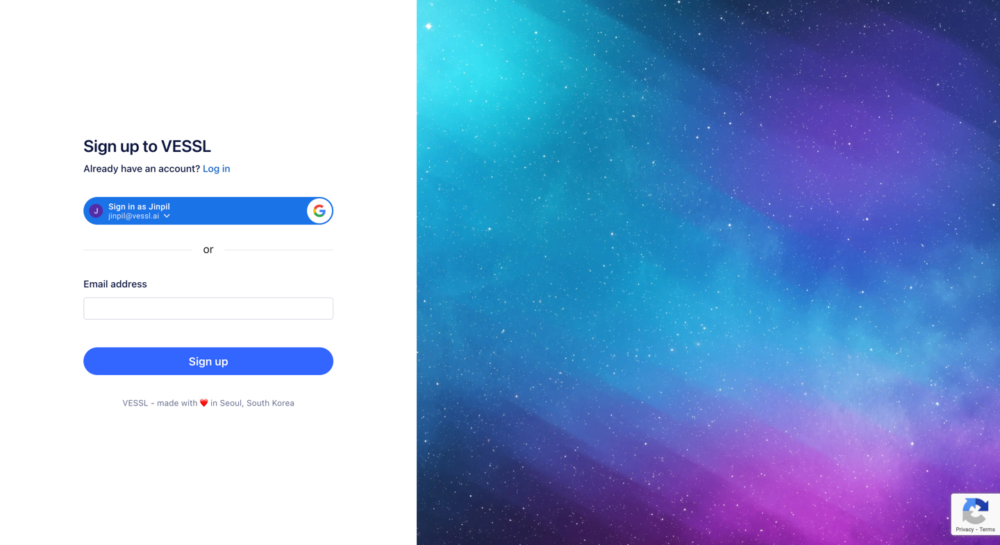
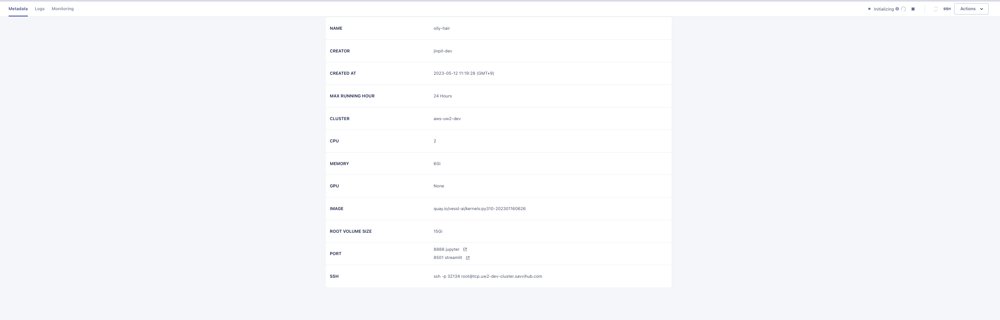

# Making Question Answering Chatbot On Any Clouds(AWS, GCP, On-premise) with VESSL

## [1] Start with VESSL 
### You can make server that can access from anywhere

### 0. Get your OpenAI API, Prepare your data (eg. books for study, documents on github, etc)
###### Get your own OpenAI API key from [here](https://platform.openai.com/account/api-keys)


### 1. Sign up to [VESSL](https://vessl.ai)


### 2. Make workspace (only cpu is enough)
###### You can connect your own GPU server or AWS, GCP cluster to VESSL

##### 2.1  Expose port 8501 for streamlit in advanced setting


#### 2.2 Copy and Paste command below to start command in advanced setting
```bash
git clone  "https://github.com/vessl-ai/examples.git" && cd /root/examples/langchain/question_answering/ && bash ./run.sh
```
### 3. Click the port 8501 link in the workspace

### 4. You can see the question answering chatbot, follow its instruction


## [2] Start with your local device

```bash
git clone  "https://github.com/vessl-ai/examples.git"
cd examples/langchain/question_answering
./run.sh
```

