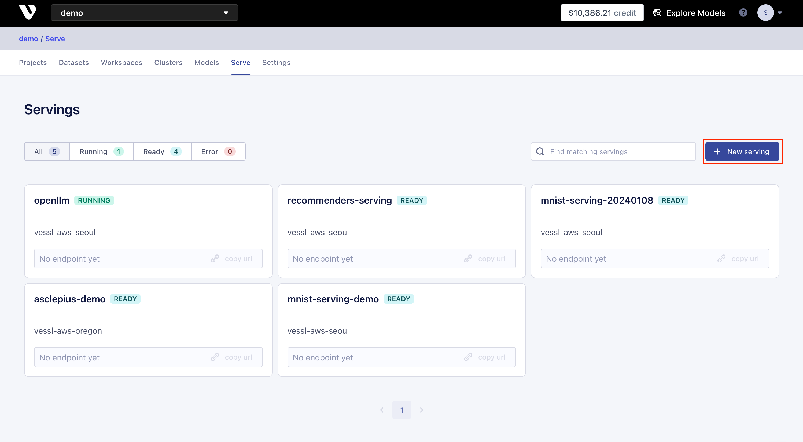
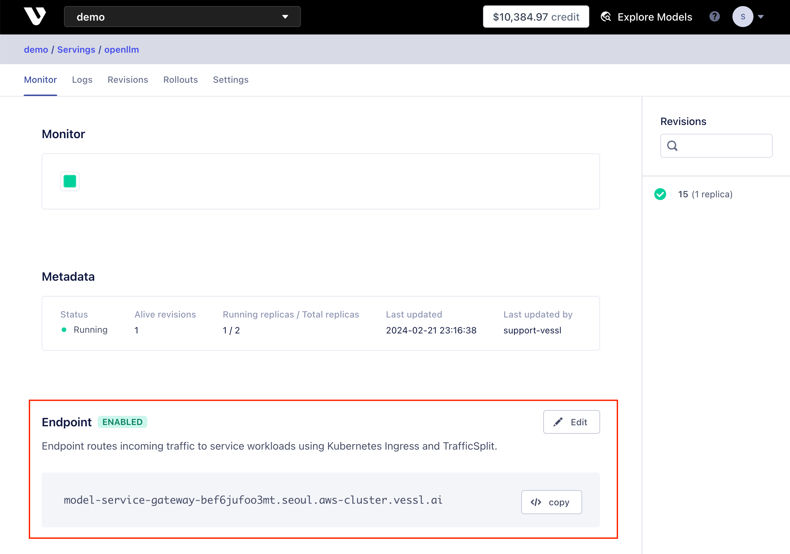
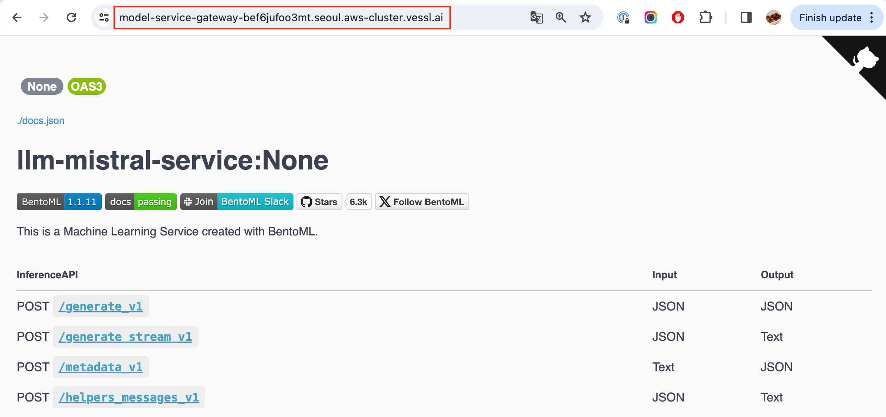

# LLM Service with OpenLLM and VESSL Serve

[](README.md) [](README-ko.md)

이 문서는 VESSL Serve와 OpenLLM을 이용해 LLM 모델을 쉽게 배포하고 모니터링하는 방법에 대해 설명합니다.
* [VESSL Serve](https://docs.vessl.ai/) 은 AI 모델을 쉽고 빠르게 배포하고 모니터링 수 있는 플랫폼입니다.
* [OpenLLM](https://vllm.ai/) 은 large language model(LLM) 을 프로덕션 환경에서 운영하기 위한 서빙 프레임워크입니다.

## 목차
0. [시작하기 전에](#시작하기-전에)
1. [VESSL Serve를 이용한 OpenLLM 서비스 배포](#1-vessl-serve를-이용한-openllm-서비스-배포)
2. [Endpoint 설정 및 테스트](#2-endpoint-설정-및-테스트)
3. [신규 버전 배포 및 트래픽 분산](#3-신규-버전-배포-및-트래픽-분산)
4. [Cleanup](#4-cleanup)
---

## 시작하기 전에

### VESSL CLI 설치 및 로그인 확인

시작하기에 앞서, 아래의 커맨드를 통해 [VESSL CLI](https://pypi.org/project/vessl/)가 설치되어 있으며, 올바르게 로그인되어 있는지 확인해주세요.

```sh
# VESSL CLI 설치
$ pip install vessl
   
# 로그인 상태 확인
$ vessl whoami

# 로그인이되어 있지 않다면, vessl configure 커맨드를 사용해서 로그인 진행
$ vessl configure
```
  
### VESSL 사용이 처음이신가요?

VESSL을 처음 사용하시는 경우,  [Quickstart](https://docs.vessl.ai/docs/en/get-started/quickstart) 가이드를 통해 기본적인 사용 방법을 익히는 것이 좋습니다.

## 1. VESSL Serve를 이용한 OpenLLM 서비스 배포

VESSL Serve에서 하나의 서비스(Service)는 Revision과 Gateway(Endpoint) 로 구성됩니다.
- Revision은 배포할 모델, 서비스할 포트, 오토스케일링(Autoscaling) 설정 등의 정보가 포함된 서비스의 한 버전을 가리킵니다.
- Gateway는 하나 혹은 그 이상의 Revision을 라우팅하고, 트래픽을 분산하는 역할을 합니다.

시작하기 전, [Serve 메인 페이지](https://vessl.ai/-/servings) 로 이동하여 "New serving"을 클릭하여 `openllm` 이라는 이름으로 새로운 서비스를 생성해주세요.




Serve의 Revision과 Gateway를 포함한 VESSL의 모든 실행 단위(workload)들은 YAML 파일로 작성하여 CLI를 통해 배포할 수 있습니다. 아래는 이번 예제에서 사용한 YAML 파일입니다.

```yaml
message: OpenLLM mistralai/Mistral-7B-Instruct-v0.2 on vLLM
image: quay.io/vessl-ai/torch:2.2.0-cuda12.3-r3
resources:
  name: gpu-a10g-small
run: pip install --upgrade openllm[vllm]; openllm start mistralai/Mistral-7B-Instruct-v0.2 --backend vllm --port 3000 --max-model-len 4096
autoscaling:
  min: 1
  max: 3
  metric: gpu
  target: 60
ports:
  - port: 3000
    name: openllm
    type: http
```

예제 폴더에 포함된 [revision-v1.yaml](revision-v1.yaml) 파일을 사용하여 Revision을 생성해보세요.

```sh
vessl serve revision create --serving openllm -f revision-v1.yaml
```

생성한 Revision의 상태는 Web Dashboard의 'Revisions' 탭, 혹은 CLI를 통해 확인할 수 있습니다.

```sh
$ vessl serve revision list --serving openllm

  Number 8
  Status running
  Message OpenLLM mistralai/Mistral-7B-Instruct-v0.2 on vLLM
```


## 2. Endpoint 설정 및 테스트

Revision을 배포한 다음에는, 실제로 endpoint가 revision에 연결되어 트래픽을 서비스할 수 있게 만들어야 합니다.

아래의 커맨드로 endpoint의 상태를 확인하면, 현재는 endpoint가 revision에 연결되어 있지 않은 상태임을 확인할 수 있습니다.

```
$ vessl service read --serving openllm

  Enabled False
  Status success
  Endpoint (not set)
  Ingress Class nginx
  Annotations (empty)
  Traffic Targets (empty)
```

아래와 같이 YAML 파일로 endpoint에 연결할 revision의 번호와 포트를 지정할 수 있습니다.

```yaml
# gateway-v1.yaml

enabled: true
targets:
- number: {number}
  port: 3000
  weight: 100
```

`vessl serve revision list --serving openllm` 명령어로 확인한 Revision의 번호를 [gateway-v1.yaml](gateway-v1.yaml) 파일의 `{number}` 대신 입력한 후, 아래의 커맨드로 endpoint를 생성해보세요.

```sh
$ vessl serve gateway update --serving openllm -f gateway-v1.yaml

  Successfully update gateway of serving openllm.
```

다시 endpoint의 상태를 CLI 혹은 web dashboard에서 확인하면, revision이 endpoint에 연결되어 있고 endpoint 주소가 생성되어 있음을 확인할 수 있습니다.

```sh
$ vessl service read --serving openllm

  Enabled True
  Status success
  Endpoint model-service-gateway-bef6jufoo3mt.seoul.aws-cluster.vessl.ai
  Ingress Class nginx
  Annotations (empty)
  Traffic Targets
  - ########## 100%:  1 (port 3000)
```



위에서 확인한 endpoint 주소로 이동하면 API 서버가 정상적으로 작동하는 것을 확인할 수 있습니다.



OpenLLM 기반의 LLM 서버는 OpenAI-compatible한 LLM 인터페이스를 제공합니다. API 서버가 정상적으로 작동하는지 확인하기 위해 [api_test.py](api_test.py) 파일을 사용하여 테스트해보세요.

```sh
$ export OPENLLM_ENDPOINT=https://model-service-gateway-bef6jufoo3mt.seoul.aws-cluster.vessl.ai
$ python api_test.py --prompt "What's the capital of France?"

  Prompt: What's the capital of France?
  Response:  The capital city of France is Paris.
  
  ----- Generation Complete! -----
  
  Request Latency: 0.67s
  Avg Token Latency: 67.209 milliseconds
  90th Percentile Token Latency: 233.015 milliseconds
  95th Percentile Token Latency: 339.892 milliseconds
  99th Percentile Token Latency: 425.394 milliseconds
```

[api_test.py](api_test.py) 와 함께, LLM 서비스의 생성 성능을 확인하기 위한 간단한 테스트 스크립트인 [load_test.py](load_test.py) 가 포함되어 있습니다. 마찬가지 방식으로 테스트해볼 수 있습니다.

```sh
$ export OPENLLM_ENDPOINT=https://model-service-gateway-bef6jufoo3mt.seoul.aws-cluster.vessl.ai
$ python load_test.py

  ...

  Avg Token Latency: 63.07 milliseconds
  90th Percentile Token Latency: 104.17 milliseconds
  95th Percentile Token Latency: 127.726 milliseconds
  99th Percentile Token Latency: 149.353 milliseconds

  Avg Request Latency: 23.683 seconds
  90th Percentile Request Latency: 32.787 seconds
  95th Percentile Request Latency: 41.397 seconds
  99th Percentile Request Latency: 63.319 seconds

  Successful Requests: 100/100
  Token Throughput: 15.815 tokens/second
```

## 3. 신규 버전 배포 및 트래픽 분산

안전하게 모델의 새로운 버전이나 설정을 배포하기 위해서는, 기존의 버전을 유지하면서 새로운 버전을 배포하고, 이후 트래픽을 새로운 버전으로 분산하는 무중단 배포 전략이 필요합니다. VESSL Serve를 활용해 이러한 무중단 배포를 쉽게 구현할 수 있습니다.

[revision-v2.yaml](revision-v2.yaml) 파일은 같은 모델에서 일부 설정을 변경한 새로운 버전의 Revision을 생성하는 예제입니다. 먼저 Revision을 생성해봅시다.

```sh
vessl serve revision create --serving openllm -f revision-v2.yaml
```

명령어를 통해 두 개의 revision이 service에 등록된 것을 확인하실 수 있습니다.

```sh
$ vessl serve revision list --serving openllm

  2 revision(s) found.

  Number 1
  Status running
  Message OpenLLM mistralai/Mistral-7B-Instruct-v0.2 on vLLM

  Number 2
  Status running
  Message Extend max model length on Mistral-7B-Instruct-v0.2
```

[gateway-v2.yaml](gateway-v2.yaml) 파일은 아래와 같이 새로운 버전의 Revision을 기존의 endpoint에 추가하고, 트래픽을 50%씩 분산하는 설정이 포함되어 있습니다.

```yaml
# gateway-v2.yaml

enabled: true
targets:
- number: 1
  port: 3000
  weight: 50
- number: 2
  port: 3000
  weight: 50
```

아래의 커맨드로 새로운 버전의 Revision을 endpoint에 추가하면 트래픽이 새로운 버전으로 분산되는 것을 확인하실 수 있습니다.

```sh
$ vessl serve gateway update --serving openllm -f gateway-v2.yaml

  Successfully update gateway of serving openllm.
  
   Enabled True
   Status success
   Endpoint model-service-gateway-bef6jufoo3mt.seoul.aws-cluster.vessl.ai
   Ingress Class nginx
   Annotations (empty)
   Traffic Targets
   - #####      50 %:  1 (port 3000)
   - #####      50 %:  2 (port 3000)
```

## 4. Cleanup

체험이 끝난 revision은 아래와 같이 종료하여 요금 발생을 방지할 수 있습니다.

```sh
# Use the number of the revision to terminate
vessl serve revision terminate --serving openllm -n 1
vessl serve revision terminate --serving openllm -n 2
```
