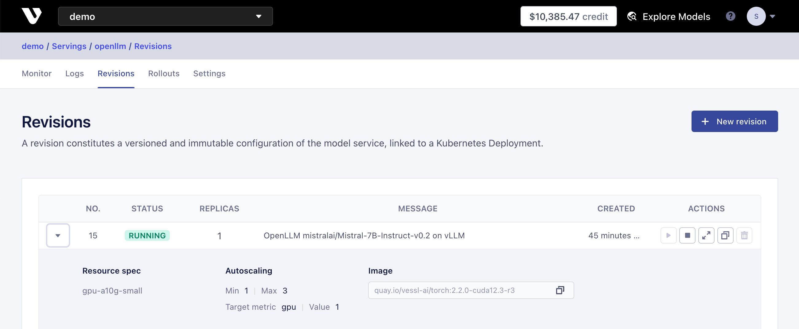

# LLM Service with OpenLLM and VESSL Service

[](README.md) [](README-ko.md)

This document explains how to easily deploy and monitor LLM models using VESSL Service and OpenLLM.
* [VESSL Service](https://docs.vessl.ai/) is a platform that allows for easy and fast deployment and monitoring of AI models.
* [OpenLLM](https://vllm.ai/) is a serving framework designed for operating large language models (LLM) in production environments.

## Table of Contents
0. [Before You Start](#before-you-start)
1. [Deploying OpenLLM Service with VESSL Service](#1-deploying-openllm-service-with-vessl-service)
2. [Setting Up and Testing Endpoints](#2-setting-up-and-testing-endpoints)
3. [Deploying New Revisions and Distributing Traffic](#3-deploying-new-revisions-and-distributing-traffic)
4. [Cleanup](#4-cleanup)
---

## Before You Start

### Installing and Checking VESSL CLI Login
Before starting, use the following commands to ensure the [VESSL CLI](https://pypi.org/project/vessl/) is installed, and you are correctly logged in.

```sh
# Install VESSL CLI
$ pip install vessl
   
# Check login status
$ vessl whoami

# If not logged in, proceed with login using the vessl configure command
$ vessl configure
```

### First Time Using VESSL?

If you're new to VESSL, it's recommended to familiarize yourself with the basic usage through the [Quickstart](https://docs.vessl.ai/docs/en/get-started/quickstart) guide.

## 1. Deploying OpenLLM Service with VESSL Service

In VESSL Service, a Service is composed of Revisions and an Endpoint(Gateway).
- A Revision refers to a version of the service containing information such as the model to deploy, the port to service, and autoscaling settings.
- An Endpoint routes one or more Revisions and distributes traffic.

To start, navigate to [Serve main page](https://vessl.ai/-/servings) and click "New serving" to create a new service named `openllm`.


All workloads in VESSL, including Serve's Revisions and Gateways, can be deployed through the CLI using YAML files. Below is the YAML file used in this example.

```yaml
message: OpenLLM mistralai/Mistral-7B-Instruct-v0.2 on vLLM
image: quay.io/vessl-ai/torch:2.2.0-cuda12.3-r3
resources:
  cluster: vessl-gcp-oregon
  preset: gpu-l4-small-spot
run: |-
  pip install --upgrade openllm[vllm]
  openllm start mistralai/Mistral-7B-Instruct-v0.2 --backend vllm --port 3000 --max-model-len 4096
service:
  expose: "3000"
  autoscaling:
    min: 1
    max: 3
    metric: nvidia.com/gpu
    target: 60
ports:
  - port: 3000
    name: openllm
    type: http
```

Use the [revision-v1.yaml](revision-v1.yaml) file included in the example folder to create a Revision.

```sh
vessl service create --service-name openllm -f revision-v1.yaml
```

The status of the created Revision can be checked in the Web Dashboard's 'Revisions' tab or through the CLI.

```sh
$ vessl serve revision list --serving openllm

  Name openllm
  Description (none)
  Created By sanghyuk@vessl.ai
  Created At 2024-08-05 01:29:36.747608+00:00
  Cluster vessl-gcp-oregon
  Status running
  Type provisioned
  Endpoint model-service-gateway-fud12qixn5y5.oregon.google-cluster.vessl.ai
```



## 2. Setting Up and Testing Endpoints

After deploying a Revision, you need to ensure the endpoint is connected to the revision to serve traffic.

Checking the status of the endpoint with the command below, you will see that currently, the endpoint is not connected to any revision.

```sh
$ vessl service read --service openllm --detail

  Enabled False
  Status success
  Endpoint (not set)
  Ingress Class nginx
  Annotations (empty)
  Traffic Targets (empty)
```

You can specify the number and port of the revision to connect to the endpoint in a YAML file as follows:

```yaml
# gateway-v1.yaml

enabled:

 true
targets:
- number: {number}
  port: 3000
  weight: 100
```

After replacing `{number}` in the [gateway-v1.yaml](gateway-v1.yaml) file with the Revision number obtained from `vessl serve revision list --serving openllm`, use the following command to create the endpoint.

```sh
$ vessl serve gateway update --serving openllm -f gateway-v1.yaml

  Successfully update gateway of serving openllm.
```

Once again, checking the status of the endpoint in the CLI or web dashboard will show that the revision is connected to the endpoint and an endpoint address has been generated.

```sh
$ vessl service read --serving openllm

  Enabled True
  Status success
  Endpoint model-service-gateway-bef6jufoo3mt.seoul.aws-cluster.vessl.ai
  Ingress Class nginx
  Annotations (empty)
  Traffic Targets
  - ########## 100%:  1 (port 3000)
```


Navigating to the confirmed endpoint address, you can see the API server is functioning correctly.


The LLM server based on OpenLLM provides an OpenAI-compatible LLM interface. To verify the API server is functioning correctly, use the [api_test.py](api_test.py) file for testing.

```sh
$ export OPENLLM_ENDPOINT=https://model-service-gateway-bef6jufoo3mt.seoul.aws-cluster.vessl.ai
$ python api_test.py --prompt "What's the capital of France?"

  Prompt: What's the capital of France?
  Response:  The capital city of France is Paris.
  
  ----- Generation Complete! -----
  
  Request Latency: 0.67s
  Avg Token Latency: 67.209 milliseconds
  90th Percentile Token Latency: 233.015 milliseconds
  95th Percentile Token Latency: 339.892 milliseconds
  99th Percentile Token Latency: 425.394 milliseconds
```

Along with [api_test.py](api_test.py), the example folder includes [load_test.py](load_test.py), a simple test script to check the generation performance of the LLM service. You can test it in the same manner.

```sh
$ export OPENLLM_ENDPOINT=https://model-service-gateway-bef6jufoo3mt.seoul.aws-cluster.vessl.ai
$ python load_test.py

  ...

  Avg Token Latency: 63.07 milliseconds
  90th Percentile Token Latency: 104.17 milliseconds
  95th Percentile Token Latency: 127.726 milliseconds
  99th Percentile Token Latency: 149.353 milliseconds

  Avg Request Latency: 23.683 seconds
  90th Percentile Request Latency: 32.787 seconds
  95th Percentile Request Latency: 41.397 seconds
  99th Percentile Request Latency: 63.319 seconds

  Successful Requests: 100/100
  Token Throughput: 15.815 tokens/second
```

## 3. Deploying New Revisions and Distributing Traffic

To deploy a new version of a model or settings safely, you need a zero-downtime deployment strategy that maintains the existing version while deploying a new one and then distributes traffic to the new version. VESSL Service allows for easy implementation of such zero-downtime deployments.

The [revision-v2.yaml](revision-v2.yaml) file is an example of creating a new version of a Revision with some changes in settings for the same model. Let's create the Revision first.

```sh
vessl serve revision create --serving openllm -f revision-v2.yaml
```

Using the command, you can confirm that two revisions have been registered to the service.

```sh
$ vessl serve revision list --serving openllm

  2 revision(s) found.

  Number 1
  Status running
  Message OpenLLM mistralai/Mistral-7B-Instruct-v0.2 on vLLM

  Number 2
  Status running
  Message Extend max model length on Mistral-7B-Instruct-v0.2
```

The [gateway-v2.yaml](gateway-v2.yaml) file contains settings to add the new version of the Revision to the existing endpoint and distribute traffic 50% to each version.

```yaml
# gateway-v2.yaml

enabled: true
targets:
- number: 1
  port: 3000
  weight: 50
- number: 2
  port: 3000
  weight: 50
```

Updating the endpoint with the new version of the Revision using the command below

 will distribute the traffic to the new version.

```sh
$ vessl serve gateway update --serving openllm -f gateway-v2.yaml

  Successfully update gateway of serving openllm.
  
   Enabled True
   Status success
   Endpoint model-service-gateway-bef6jufoo3mt.seoul.aws-cluster.vessl.ai
   Ingress Class nginx
   Annotations (empty)
   Traffic Targets
   - #####      50 %:  1 (port 3000)
   - #####      50 %:  2 (port 3000)
```

## 4. Cleanup

You can terminate the revisions after the experience to prevent charges as follows:

```sh
# Use the number of the revision to terminate
vessl serve revision terminate --serving openllm -n 1
vessl serve revision terminate --serving openllm -n 2
```
