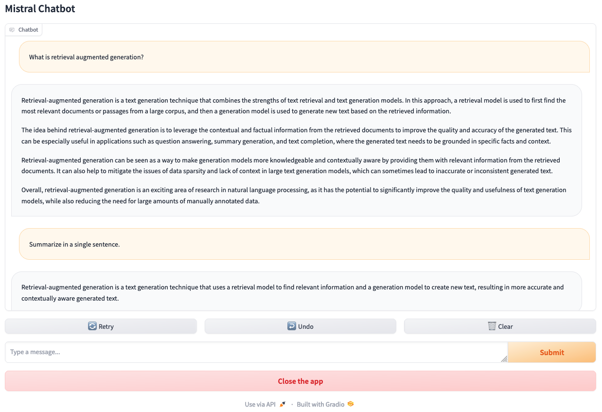

# Chat Interface With HuggingFace OSS Models and Gradio

Run open source LLMs from HuggingFace with a simple chat interface using Gradio.

You can load & run any models which can be loaded using `AutoModelForCausalLM.from_pretrained()`in [Transformers](https://github.com/huggingface/transformers) library.



## Run in Local

> **NOTE**: You might need NVIDIA GPU to accelerate inference of the LLM loaded.

1. Clone the repository:

   ```bash
   git clone https://github.com/vessl-ai/examples.git
   cd examples/hf-chatbot
   ```

1. Install the required dependencies:

   ```bash
   pip install -r requirements.txt
   ```

1. Run the application:

   ```bash
   python app.py
   ```

1. Access the Gradio interface by opening [http://localhost:7860](http://localhost:7860) in your web browser.

## Deploying on VESSL

To deploy the chatbot on VESSL, follow these steps:

1. Create a new project on VESSL.

2. Use the provided YAML file [(`run.yaml`)](./run.yaml) to configure the deployment settings, including resources, image, import statements, run commands, and environment variables.

3. Deploy the application on VESSL using the configured YAML file:

   ```bash
   vessl run create -f run.yaml
   ```

Feel free to explore and interact with the chatbot on VESSL!

> **Note:** Make sure to customize the YAML file according to your specific requirements and environment.

## Advanced topic: Loading Custom Models

You can load your own models you trained or fine-tuned by importing the model checkpoint from VESSL Model Registry.
