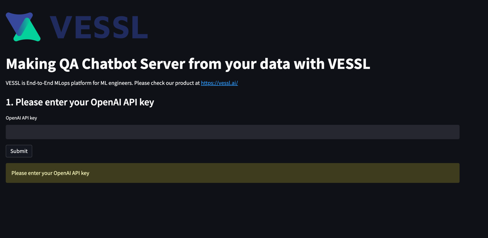

# Making Question Answering Chatbot On Any Clouds(AWS, GCP, On-premise) with VESSL

## [1] Start with VESSL 
### You can make server that can access from anywhere

### 0. Get your OpenAI API
###### Get your own OpenAI API key from [here](https://platform.openai.com/account/api-keys)

### 1. Sign up to [VESSL](https://vessl.ai)


### 2. Make workspace (only cpu is enough)
###### You can connect your own GPU server or AWS, GCP cluster to VESSL

##### 2.1  Expose port 8501 for streamlit in advanced setting
##### 2.2 copy and paste the code below to the init command

```bash
git clone  "https://github.com/vessl-ai/examples.git" && cd ~/examples/langchain/question_answering/ && bash ./run.sh
```


### 3. Click Link and Follow streamlit link to use your QA chatbot


## [2] Start with your local device

```bash
git clone  "https://github.com/vessl-ai/examples.git"
cd examples/question_answering
./run.sh
```

