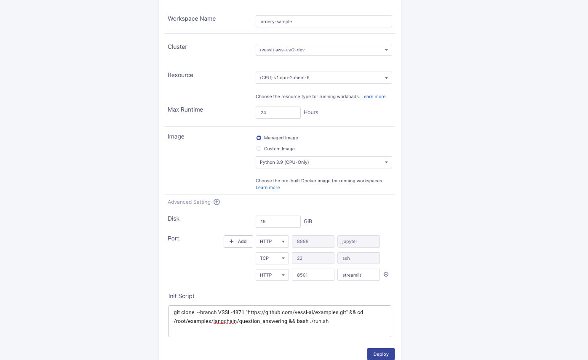

# Making Question Answering Server with your own data

## [1] Start with VESSL 
### You can make server that can access from anywhere


### 1. Sign up to [VESSL](https://vessl.ai)


### 2. Make workspace (only cpu is enough)



### 3. Using Jupyter Notebook, access it and run the code 


copy and paste the code below to the notebook and run it
```bash
git clone  "https://github.com/vessl-ai/examples.git"
```
```bash
cd examples/question_answering
```
```bash
./run.sh
```


## [2] Start with your local device

```bash
git clone  "https://github.com/vessl-ai/examples.git"
cd examples/question_answering
./run.sh
```

## OpenAI API
Get your own OpenAI API key from [here](https://beta.openai.com/)
