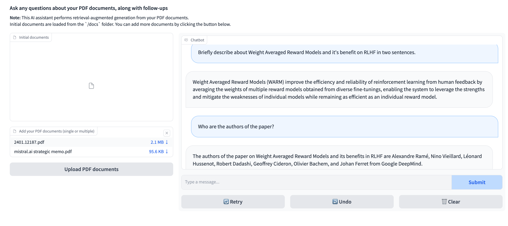

# PDF Chatbot with LlamaIndex and Open-source LLMs

This repository contains code for a PDF chatbot powered by LlamaIndex and Open-source LLMs on HuggingFace🤗.
The app uses RAG(Retrieval Generated Augmentation) Using vector database. It initializes a vector database from a list of PDF documents, allowing the chatbot to retrieve relevant information. Users can add more documents to the vector database and interact with the chatbot through Gradio's user interface.



## How to Run it Locally

1. Visit https://huggingface.co/settings/tokens to get your Hugging Face API token.

1. Clone the repository:

   ```bash
   git clone https://github.com/vessl-ai/examples.git
   cd examples/pdf-chatbot
   ```

1. Install the required dependencies:

   ```bash
   pip install -r requirements.txt
   ```

1. Run the application:

   ```bash
   python app.py --docs-folder=/path/to/your/docs/folder --hf-token=<YOUR_HF_API_TOKEN>
   ```

   Replace `/path/to/your/docs/folder` with the path to the folder containing your PDF documents, and `YOUR_HF_API_TOKEN` with your actual Hugging Face API token.

4. Access the Gradio interface by opening [http://localhost:7860](http://localhost:7860) in your web browser.

## Deploying on VESSL

Deploy the PDF chatbot on VESSL to make it accessible on cloud with a web browser. VESSL is a platform for deploying and managing AI applications. It allows you to deploy your AI applications on the cloud with a single command, and provides a web interface for managing your applications.

To deploy the PDF chatbot on VESSL, follow these steps:

1. Create a new project on VESSL.

2. Use the provided YAML file [(`run.yaml`)](./run.yaml) to configure the deployment settings, including resources, image, import statements, run commands, and environment variables.

3. Ensure you have a valid Hugging Face API token (`HUGGINGFACEHUB_API_TOKEN`) and replace `<YOUR_HF_API_TOKEN>` in the YAML file with your actual token.

4. Deploy the application on VESSL using the configured YAML file:

   ```bash
   vessl run create -f run.yaml
   ```

Feel free to explore and interact with the PDF chatbot on VESSL!

**Note:** Make sure to customize the YAML file according to your specific requirements and environment.

For additional information and support, refer to the [VESSL documentation](https://docs.vessl.ai/).
