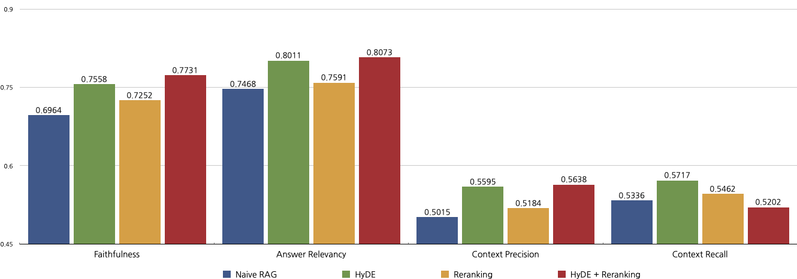
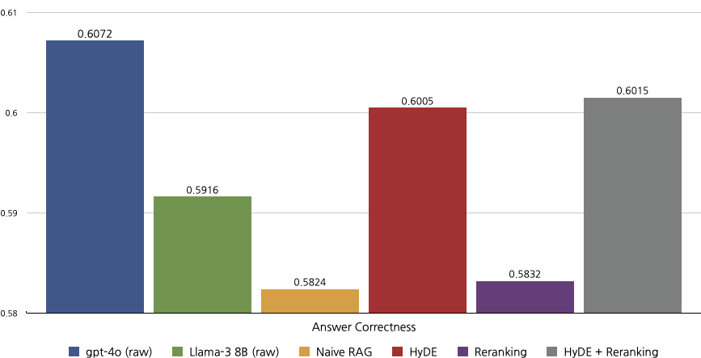
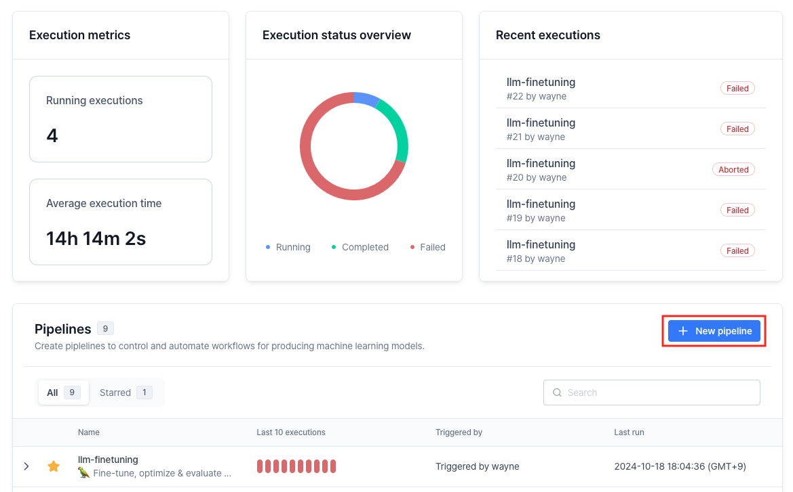
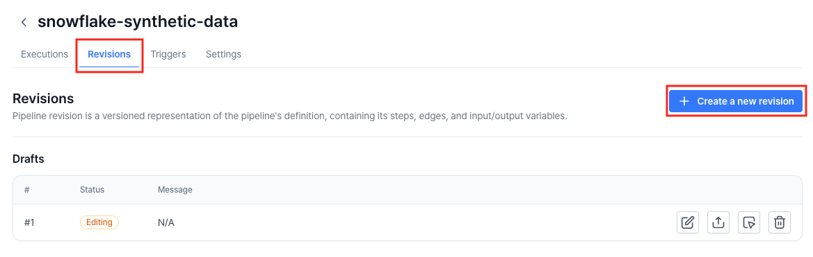
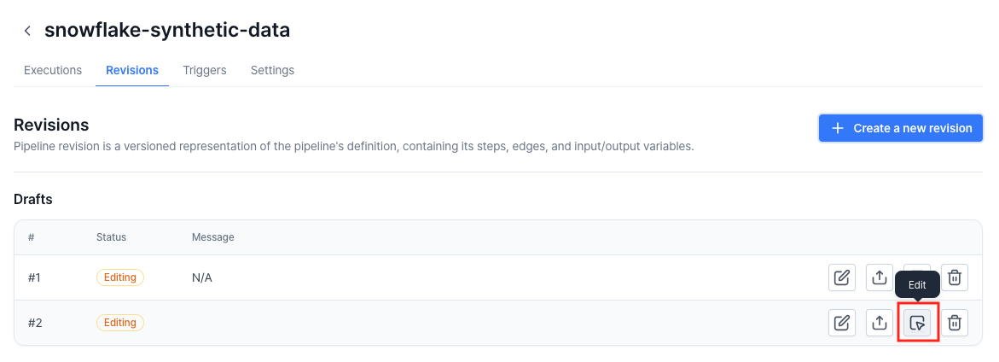
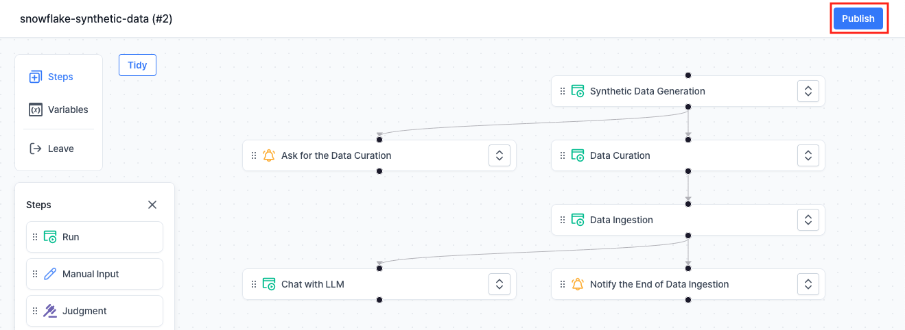
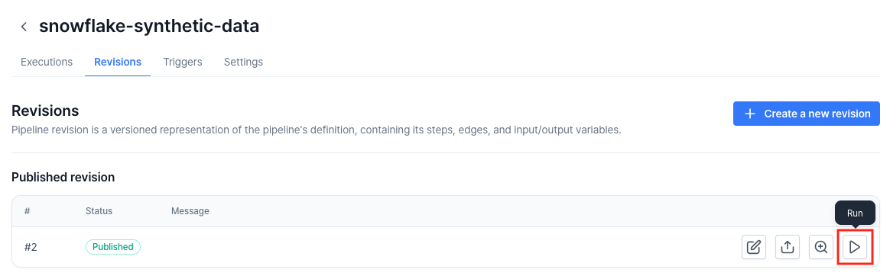

# Evaluate RAG with Ragas

This repository contains the codes and VESSL Pipeline menifest needed to load the [FEVER](https://huggingface.co/datasets/fever/fever) dataset into a vector database, execute the Retrieval Augmented Generation (RAG) chain with [Langchain](https://github.com/langchain-ai/langchain) to generate answers, and evaluate those answers with [Ragas](https://github.com/explodinggradients/ragas).

**FEVER (Fact Extraction and VERification)** consists of 185,445 claims generated by altering sentences extracted from Wikipedia and subsequently verified without knowledge of the sentence they were derived from. The claims are classified as **Supported**, **Refuted** or **NotEnoughInfo**.

**Ragas** is a framework that helps you evaluate your RAG pipelines. Ragas provides you with the tools based on the latest research for evaluating LLM-generated text to give you insights about your RAG pipeline.

### Expedted Results



For further details, please refer to our [blog post](https://blog.vessl.ai/en/posts/private-llm-rag).

## Overview
This example includes the following steps:

1. **Load the FEVER dataset into a vector database:**
    - Load the wikipedia pages of the FEVER dataset into a Chroma vector database. The full dataset contains 5 million documents, but for the sake of simplicity, only 200,000 documents are loaded in this example.

2. **Execute RAG chains:**
    - Execute four types of RAG chains to generate answers based on the FEVER dataset:
        - Naive RAG
        - RAG with HyDE
        - RAG with Reranking
        - RAG with HyDE and Reranking

3. **Evaluate the RAG chains:**
    - Evaluate the answers generated by each RAG chain with Ragas.

## Running with VESSL Pipeline
VESSL Pipeline is a tool designed for those working on streamlining complex machine learning workflows. By focusing on automation, it reduces manual intervention, making it especially useful for workflows that require consistent and repeated executions.

To run the RAG evaluation pipeline with VESSL Pipeline, follow the steps below:

1. Go to the VESSL Pipelines page. Create a new pipeline.
    
2. Create a new revision at the **Revisions** tab.
    
3. Enable the **Create from YAML** toggle and upload the YAML file.
4. Click **Edit** button of the revision you just created.
    
5. Click **Publish** button to publish the revision.
    
6. Click **Run** button of the revision you just published.
    
7. Enter input variables and trigger the revision:
    - (not yet implemented)
8. You can check the process at the **Executions** tab.

For additional information and support, please refer to the [VESSL documentation](https://docs.vessl.ai).

## Citation
```bibtex
@inproceedings{Thorne18Fever,
    author = {Thorne, James and Vlachos, Andreas and Christodoulopoulos, Christos and Mittal, Arpit},
    title = {{FEVER}: a Large-scale Dataset for Fact Extraction and {VERification}},
    booktitle = {NAACL-HLT},
    year = {2018}
}
```
```bibtex
@misc{es2023ragasautomatedevaluationretrieval,
      title={RAGAS: Automated Evaluation of Retrieval Augmented Generation}, 
      author={Shahul Es and Jithin James and Luis Espinosa-Anke and Steven Schockaert},
      year={2023},
      eprint={2309.15217},
      archivePrefix={arXiv},
      primaryClass={cs.CL},
      url={https://arxiv.org/abs/2309.15217}, 
}
```
```bibtex
@misc{gao2022precisezeroshotdenseretrieval,
      title={Precise Zero-Shot Dense Retrieval without Relevance Labels}, 
      author={Luyu Gao and Xueguang Ma and Jimmy Lin and Jamie Callan},
      year={2022},
      eprint={2212.10496},
      archivePrefix={arXiv},
      primaryClass={cs.IR},
      url={https://arxiv.org/abs/2212.10496}, 
}
```