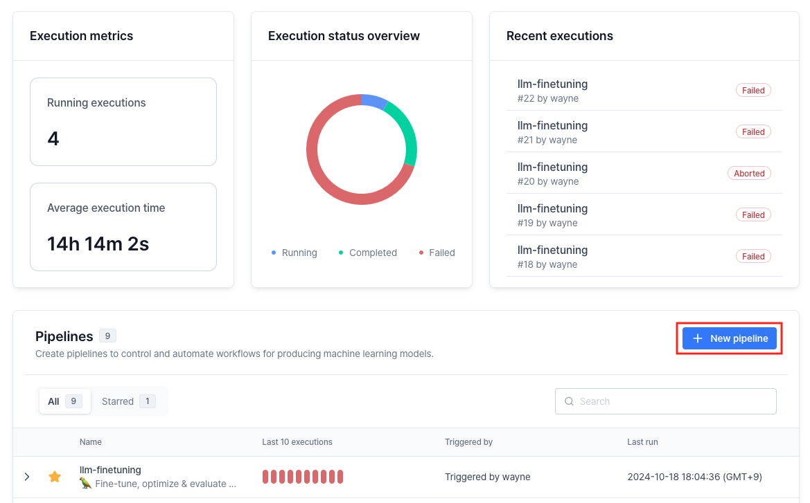
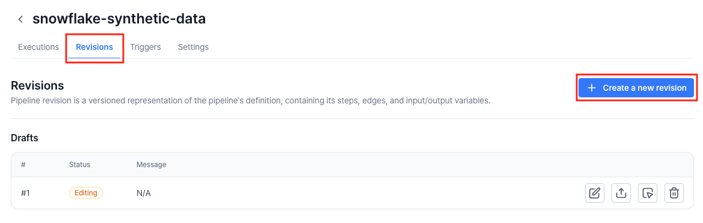
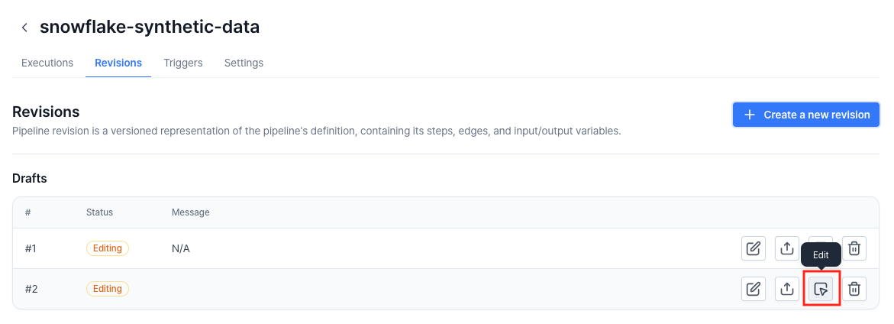
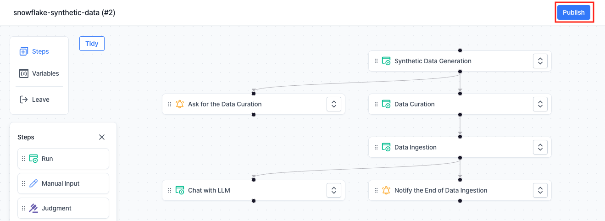
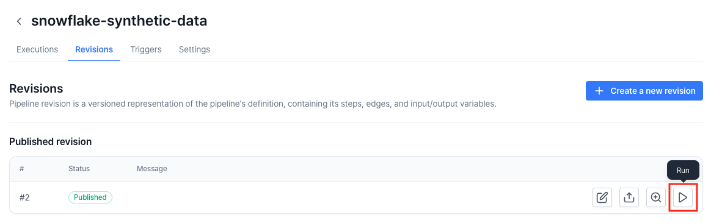

# Generate Synthetic Data with Snowflake Cortex

This repository contains code and VESSL Pipeline manifest to generate, curate, and utilize synthetic data, leveraging [**Snowflake Cortex**](https://www.snowflake.com/en/data-cloud/cortex/), a suite of AI features that use large language models (LLMs) to understand unstructured data, answer freeform questions, and provide intelligent assistance.

Snowflake Cortex gives you instant access to industry-leading large language models (LLMs) trained by researchers at companies like Mistral, Reka, Meta, and Google, including Snowflake Arctic, an open enterprise-grade model developed by Snowflake. Since these LLMs are fully hosted and managed by Snowflake, using them requires no setup. Your data stays within Snowflake, giving you the performance, scalability, and governance you expect.

## Overview
This example includes the following steps:

1. **Generate Synthetic Data:**
    
    Synthetic data is generated in a FAQs style based on VESSL documentation using Snowflake Cortex. The data simulates responses that mirror real VESSL documentation, but in a structured, controlled manner to ensure variety and usefulness for testing or training purposes.

2. **Curate Data Using Gradio:**
    
    After the synthetic data is generated, a Gradio interface allows users to review and curate the generated data. Gradio provides a simple and intuitive way for users to remove inappropriate or irrelevant content, ensuring the synthetic data meets specific quality standards.

3. **Save and Vectorize Data in Snowflake:**
    
    Once curated, the data is saved in Snowflake and vectorized using Snowflake Cortex. Vectorization is a crucial step that transforms the data into a format that can be efficiently searched and used in machine learning models, including retrieval-augmented generation (RAG) workflows.

4. **Gradio Chatbot with RAG and Snowflake Cortex:**
    
    The pipeline also includes a Gradio-based chatbot app that implements a RAG system. The chatbot uses the curated, vectorized data stored in Snowflake, to respond to user queries with contextually accurate and relevant answers. This demonstrates how RAG can enhance chatbot performance by grounding its responses in specific data stored within Snowflake.

## Prerequisites: Snowflake Settings
> **Note**: This example utilizes Snowflake's computing resources and storage, and additional charges from Snowflake may apply.

You need a Snowflake account to execute this pipeline:

1. Create a Snowflake account if you don't have one.
2. [Configure key pair authentication](https://docs.snowflake.com/en/user-guide/key-pair-auth#configuring-key-pair-authentication) in your Snowflake account.
3. [Create a new secret](https://docs.vessl.ai/guides/organization/secrets) in your VESSL organization with name `snowflake-private-key`. Its value is the private key of the key pair you created above.
    > **Note:** Secrets only accepts single line texts. You have to replace new lines in the private key with a newline character(`\n`).
4. Create a database and a schema in your Snowflake account to save the synthetic data.
5. Create a warehouse if you don't have one.

## Running Locally
1. Clone this repository and install dependencies:
    ```sh
    $ git clone https://github.com/vessl-ai/examples.git
    $ cd examples/pipelines/synthetic-data-snowflake
    $ pip install -r requirements.txt
    $ pip install gradio
    ```

2. Export Snowflake credentials as environment variables:
    ```sh
    $ export SNOWFLAKE_ACCOUNT={Snowflake account identifier}
    $ export SNOWFLAKE_USER={Snowflake account user name}
    $ export SNOWFLAKE_PRIVATE_KEY={Snowflake private key}
    $ export SNOWFLAKE_WAREHOUSE={Snowflake warehouse name}
    ```

3. Run the python files one by one:
    ```sh
    $ python 1_generate_synthetic_data.py
    $ python 2_data_curation.py --input-path samples.csv --output-path samples-curated.csv
    $ python 3_data_ingest.py \
        --data-path samples-curated.csv \
        --database {database name} \
        --schema {schema name}
    $ python 4_chat.py --database {database name} --schema {schema name}
    ```

## Running with VESSL Pipeline
VESSL Pipeline is a tool designed for those working on streamlining complex machine learning workflows. By focusing on automation, it reduces manual intervention, making it especially useful for workflows that require consistent and repeated executions.

To create and run the synthetic data generation pipeline, follow the steps below:

1. Replace the email address in the YAML file in this folder ([`pipeline.yaml`](./pipeline.yaml)) with your own email address.
    ```yaml
    # pipeline.yaml
    ...
    steps:
    ...
      - key: notify-curation
        ...
        spec:
          email_addresses:
            - test@example.com
    ...
      - key: notify-ingestion
        ...
        spec:
          email_addresses:
            - test@example.com
    ```
2. Go to the VESSL Pipelines page. Create a new pipeline.
    
3. Create a new revision at the **Revisions** tab.
    
4. Enable the **Create from YAML** toggle and upload the YAML file.
5. Click **Edit** button of the revision you just created.
    
6. Click **Publish** button to publish the revision.
    
7. Click **Run** button of the revision you just published.
    
8. Enter input variables and trigger the revision:
    - `SNOWFLAKE_ACCOUNT`, `SNOWFLAKE_USER`: The account identifier and the username you created above.
    - `SNOWFLAKE_WAREHOUSE`: Snowflake warehouse name you want to use.
    - `DATABASE`, `SCHEMA`: Database and schema name you created above.
    - `TABLE_NAME`: A name for the synthetic data table. A new table will be created.
    - `EMBEDDING_MODEL`, `LLM_MODEL`: Model names to use with Snowflake Cortex. Check which model is available in which region at the [Snowflake documentation](https://docs.snowflake.com/en/user-guide/snowflake-cortex/llm-functions#availability).
    - `VECTOR_DIM` Vector dimension of the embedding model. Note that a certain embedding model is bound to a certain dimension.
9. You can check the process at the **Executions** tab.