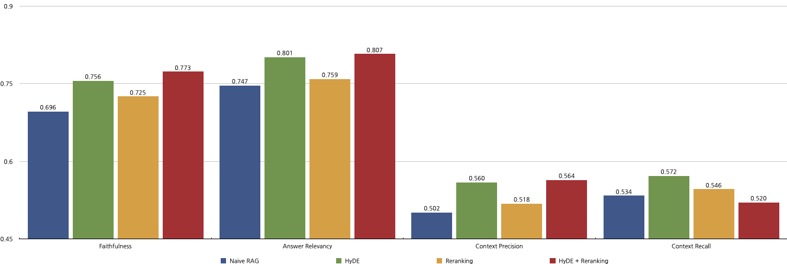
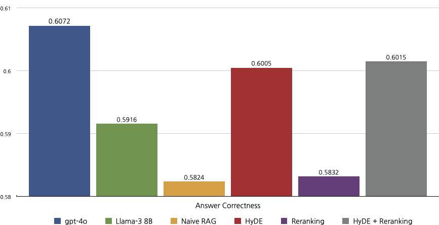

# Evaluate RAG with Ragas

This repository contains the codes and VESSL Run templates needed to load the [FEVER](https://huggingface.co/datasets/fever/fever) dataset into a vector database, execute the Retrieval Augmented Generation (RAG) chain with [Langchain](https://github.com/langchain-ai/langchain) to generate answers, and evaluate those answers with [Ragas](https://github.com/explodinggradients/ragas).

**FEVER (Fact Extraction and VERification)** consists of 185,445 claims generated by altering sentences extracted from Wikipedia and subsequently verified without knowledge of the sentence they were derived from. The claims are classified as **Supported**, **Refuted** or **NotEnoughInfo**.

**Ragas** is a framework that helps you evaluate your RAG pipelines. Ragas provides you with the tools based on the latest research for evaluating LLM-generated text to give you insights about your RAG pipeline.

### Expedted Results



For further details, please refer to our blog post.

## Running Locally
> While you can run this pipeline in a local environment, we strongly recommend using VESSL Run for consistent environment management.
1. Clone the repository:
    ```sh
    $ git clone https://github.com/vessl-ai/examples.git
    $ cd examples/rag-evaluation
    ```

2. Install required dependencies:
    ```sh
    $ pip install -r requirements.txt
    ```

3. Set environment variables. You MUST set `OPENAI_API_KEY` if you plan to use OpenAI API:

    ***NOTE:** Evaluation pipeline could cost you a lot of credits if you use OpenAI API.*
    ```sh
    $ export OPENAI_API_KEY="sk-1234567890"
    ```

4. Run the scripts consecutively:
    ```sh
    $ python 1-data-ingestion.py \
        --data-path ${path to save claims} \
        --chroma-path ${Chroma persistent client path} \
        --collection-name ${Chroma collection name} \
        --embedding-model ${embedding model for vectorization}

    $ python 2-rag-chain.py \
        --rag-pattern ${one of [naive, hyde, reranking, hyde-reranking]} \
        --data-path ${path where you saved claims} \
        --chroma-path ${Chroma persistent client path} \
        --collection-name ${Chroma collection name} \
        --embedding-model ${embedding model for vectorization} \
        --llm-endpoint ${any OpenAI-compatible endpoint} \
        --llm-model ${LLM model to use in the endpoint above} \
        --reranker-model ${reranker model, if the RAG pattern includes reranking} \
        --output-path ${path to save the RAG chain results}

    $ python 3-rag-evaluation.py \
        --rag-pattern ${one of [naive, hyde, reranking, hyde-reranking]} \
        --data-path ${path where you saved the RAG chain results} \
        --evaluation-endpoint ${any OpenAI-compatible endpoint} \
        --embedding-model ${embedding model for vectorization}
    ```

5. (Optional) You can also evaluate LLMs without RAG:
    ```sh
    # No need to run the data ingestion script if you already have above
    $ python 1-data-ingestion.py \
        --data-path ${path to save claims} \
        --chroma-path ${Chroma persistent client path} \
        --collection-name ${Chroma collection name} \
        --embedding-model ${embedding model for vectorization}

    $ python 2.1-raw-llm-chain.py \
        --data-path ${path where you saved claims} \
        --llm-endpoint ${any OpenAI-compatible endpoint} \
        --llm-model ${LLM model to use in the endpoint above} \
        --output-path ${path to save the LLM chain results}

    $ python 3.1-raw-llm-evaluation.py \
        --data-path ${path where you saved the RAG chain results} \
        --evaluation-endpoint ${any OpenAI-compatible endpoint} \
        --embedding-model ${embedding model for vectorization}
    ```

## Running with VESSL Run
VESSL is a platform for deploying and managing AI applications. It allows you to deploy your AI applications on the cloud with a single command, and provides a web interface for managing your applications.

To run the RAG evaluation pipeline with VESSL Run, follow the steps below:

1. Install VESSL CLI and configure your identity:
    ```sh
    $ pip install --upgrade vessl
    $ vessl configure
    ```
2. (Optional) Create a new project (replace `${PROJECT_NAME}` with the project name):
    ```sh
    $ vessl project create ${PROJECT_NAME}
    $ vessl configure -p ${PROJECT_NAME}
    ```

3. (Optional) If you plan to use OpenAI API, create a secret with your OpenAI API key. Please refer to the [documentation](https://docs.vessl.ai/guides/organization/secrets) for instructions.

    ***NOTE:** Evaluation pipeline could cost you a lot of credits if you use OpenAI API.*

4. Create VESSL Datasets for persistent Chroma client, claims based on FEVER dataset, and RAG results respectively:
    ```sh
    $ vessl dataset create ${CHROMA_DATASET_NAME}
    $ vessl dataset create ${FEVER_DATASET_NAME}
    $ vessl dataset create ${RAG_RESULTS_DATASET_NAME}
    ```

5. Clone the repository:
    ```sh
    $ git clone https://github.com/vessl-ai/examples.git
    $ cd examples/rag-evaluation
    ```

6. Change values in the YAML files.
    1. Replace the VESSL Dataset paths with ones you created above, e.g.:
        ```yaml
        export:
            /chroma/: vessl-dataset://{organization}/{chroma-dataset-name}
            /data/: vessl-dataset://{organization}/{claims-dataset-name}
        ```
    2. Choose from the following RAG types: `naive`, `hyde`, `reranking`, and `hyde-reranking`.
        ```yaml
        env:
            RAG_PATTERN: naive
        ```
    3. You can change models and endpoints, such as `LLM_ENDPOINT`, `LLM_MODEL`, `EMBEDDING_MODEL` and `RERANKER_MODEL`, in the environent variables section.

    4. If you plan to use OpenAI API, you MUST make `OPENAI_API_KEY` refer to the secret you created above:

        ***NOTE:** Evaluation pipeline could cost you a lot of credits if you use OpenAI API.*
        ``` yaml
        env:
            OPENAI_API_KEY:
                secret: ${secret_name}
        ```

7. Create VESSL Run consecutively:
    ```sh
    $ vessl create run -f 1-data-ingestion.yaml
    $ vessl create run -f 2-rag-chain.yaml
    $ vessl create run -f 3-rag-evaluation.yaml
    ```

8. (Optional) You can also evaluate LLMs without RAG:
    ```sh
    $ vessl create run -f 1-data-ingestion.yaml
    $ vessl create run -f 2.1-raw-llm-chain.yaml
    $ vessl create run -f 3.1-raw-llm-evaluation.yaml
    ```

For additional information and support, please refer to the [VESSL documentation](https://docs.vessl.ai).

## Citation
```bibtex
@inproceedings{Thorne18Fever,
    author = {Thorne, James and Vlachos, Andreas and Christodoulopoulos, Christos and Mittal, Arpit},
    title = {{FEVER}: a Large-scale Dataset for Fact Extraction and {VERification}},
    booktitle = {NAACL-HLT},
    year = {2018}
}
```
```bibtex
@misc{es2023ragasautomatedevaluationretrieval,
      title={RAGAS: Automated Evaluation of Retrieval Augmented Generation}, 
      author={Shahul Es and Jithin James and Luis Espinosa-Anke and Steven Schockaert},
      year={2023},
      eprint={2309.15217},
      archivePrefix={arXiv},
      primaryClass={cs.CL},
      url={https://arxiv.org/abs/2309.15217}, 
}
```
```bibtex
@misc{gao2022precisezeroshotdenseretrieval,
      title={Precise Zero-Shot Dense Retrieval without Relevance Labels}, 
      author={Luyu Gao and Xueguang Ma and Jimmy Lin and Jamie Callan},
      year={2022},
      eprint={2212.10496},
      archivePrefix={arXiv},
      primaryClass={cs.IR},
      url={https://arxiv.org/abs/2212.10496}, 
}
```