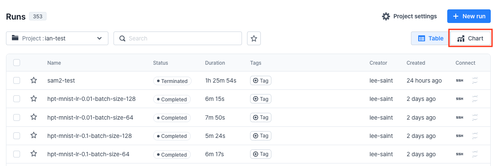
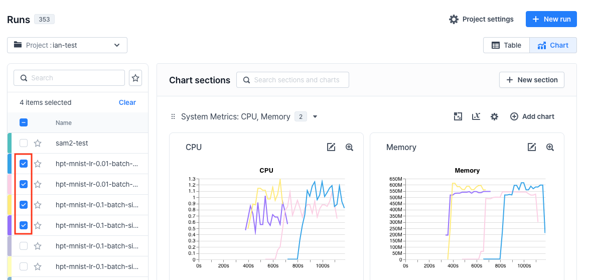
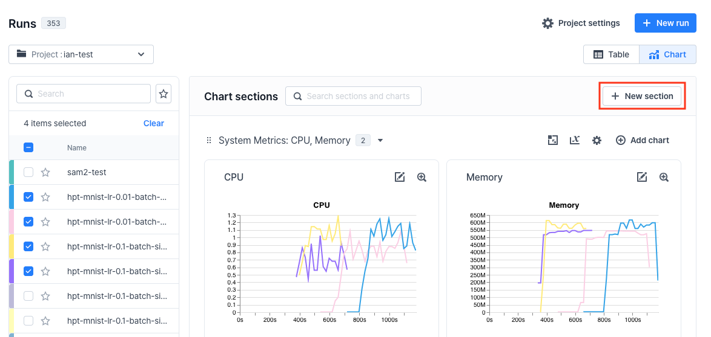
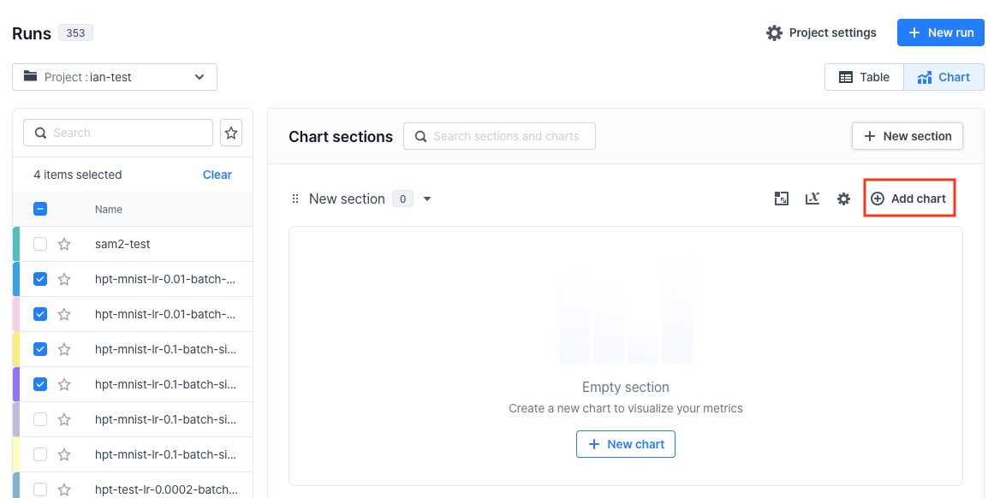
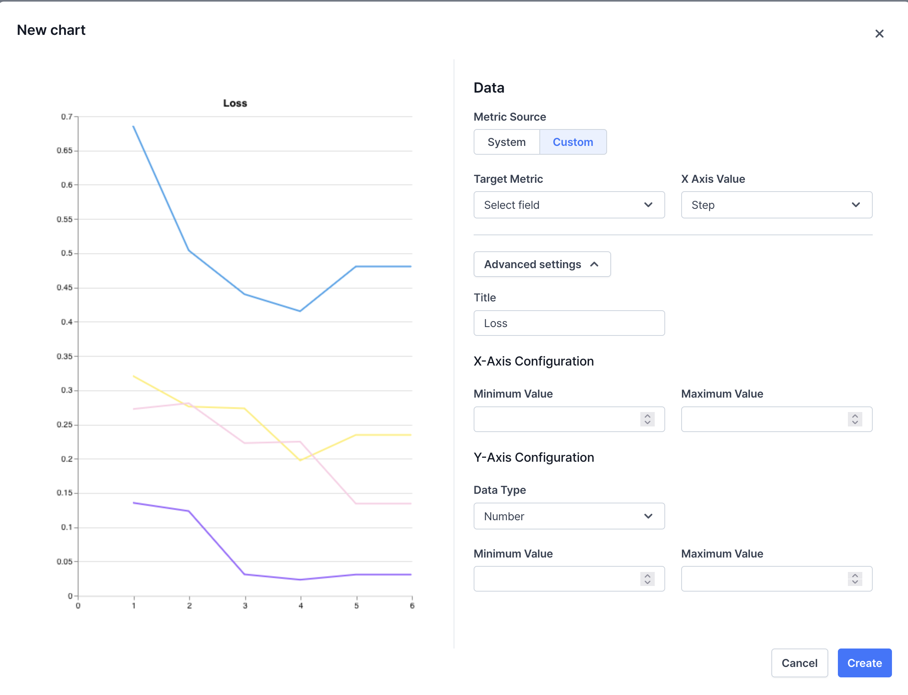

# Hyperparameter tuning

This is a sample hyperparameter tuning script for MNIST training.

## Creating VESSL Run jobs
1. Install vessl Python SDK and configure your organization and project, if you haven't yet:
    ```sh
    $ pip install vessl
    $ vessl configure
    ```

2. Clone this repository:
    ```sh
    $ git clone https://github.com/vessl-ai/examples.git
    $ cd examples/runs/hyperparameter-tuning
    ```

3. Run the hyperparameter tuning script. This script will sequentially initiate a total of four VESSL Runs, one for each combination of parameters:
    ```sh
    $ python hpt.py
    ```

## Customization
1. Modify the `parameters` dictionary in the hyperparameter tuning script:
    - Key: parameter name.
    - Value: list of values.
    
    ```python
    # hpt.py
    ...
    parameters = {
        "lr": [0.1, 0.01],
        "batch_size": [64, 128],
    }
    ...
    ```

2. Customize the Run template file. Refer to the [documentation](https://docs.vessl.ai/reference/yaml/run-yaml) for detail.
    
    The parameter name must match the key of the `parameters` dictionary above and be parenthesized with double curly braces(`{{}}`):

    ```yaml
    # run_template.yaml
    name: hpt-mnist-lr-{{lr}}-batch-size-{{batch_size}}
    ...
    env:
      epochs: 5
      learning_rate: {{lr}}
      batch_size: {{batch_size}}
    ```

3. Run the hyperparameter tuning script.

## Evaluation

You can compare the metrics of the each run with interactive graphs on the VESSL website:

1. Click **Chart** at your project page you configured above.
    

2. Select the run names you would like to compare.
    

3. Click **New section** button.
    

4. Click **Add chart** on the section created above.
    

5. Create a chart:
    - Select **Custom** for **Metric Source**.
    - Select a **Target Metric**.
    - Give it a self-explanatory **Title** (which is under the **Advanced settings** section).

    