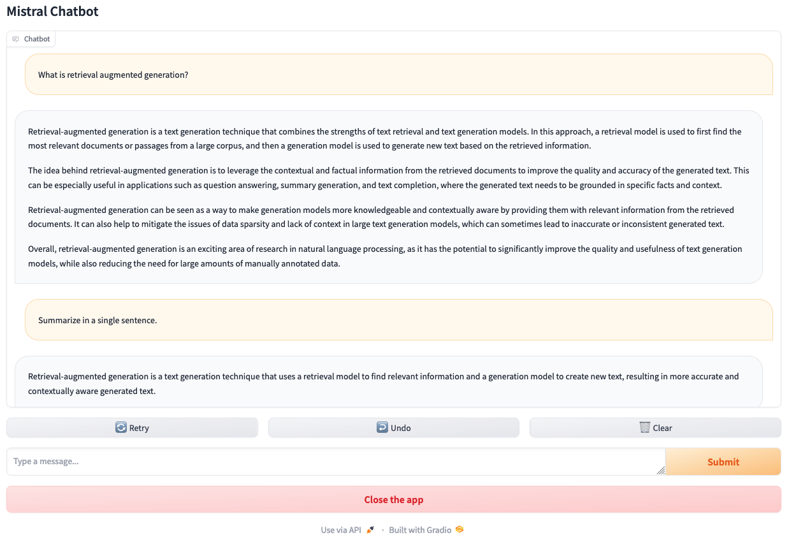

# Mistral Chatbot

Mistral-7B is open-source LLM developed by Mistral AI. The model utilizes a grouped query attention (GQA) and a sliding window attention mechanism (SWA), which enable faster inference and handling longer sequences at smaller cost than other models. As a result, it achieves both efficiency and high performance. Mistral-7B outperforms Llama 2 13B on all benchmarks and Llama 1 34B in reasoning, mathematics, and code generation benchmarks.



## Run in Local

> **NOTE**: To run this example, you need a machine with an NVIDIA gpu.

1. Clone the repository:

   ```bash
   git clone https://github.com/vessl-ai/examples.git
   cd examples/mistral-chatbot
   ```

1. Install the required dependencies:

   ```bash
   pip install -r requirements.txt
   ```

1. Run the application:

   ```bash
   python app.py
   ```

1. Access the Gradio interface by opening [http://localhost:7860](http://localhost:7860) in your web browser.

## Deploying on VESSL

To deploy the Mistral chatbot on VESSL, follow these steps:

1. Create a new project on VESSL.

2. Use the provided YAML file [(`run.yaml`)](./run.yaml) to configure the deployment settings, including resources, image, import statements, run commands, and environment variables.

3. Deploy the application on VESSL using the configured YAML file:

   ```bash
   vessl run create -f run.yaml
   ```

Feel free to explore and interact with the chatbot on VESSL!

> **Note:** Make sure to customize the YAML file according to your specific requirements and environment.
