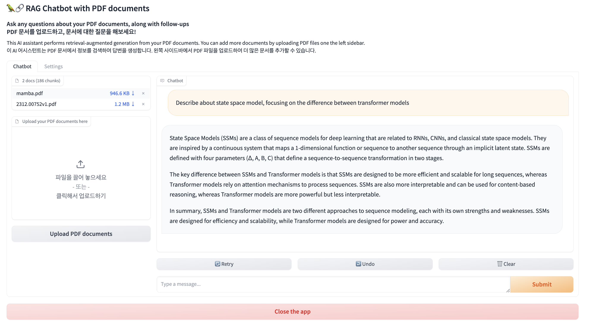

# Simple RAG Chatbot with LangChain and Open-source LLMs

This repository contains code for a RAG chatbot powered by LangChain and Open-source LLMs on HuggingFace🤗.

The app uses RAG(Retrieval Generated Augmentation) Using vector database. It initializes a vector database from a list of PDF documents, allowing the chatbot to retrieve relevant information. Users can add more documents to the vector database and interact with the chatbot through Gradio's user interface.



## How to Run it Locally

1. Clone the repository:

   ```bash
   git clone https://github.com/vessl-ai/examples.git
   cd examples/rag-chatbot
   ```

1. Install the required dependencies:

   ```bash
   pip install -r requirements.txt
   ```

1. Run the application:

   ```bash
   python app.py --llm-host $LLM_HOST
   ```

   Replace `$LLM_HOST` with the URL of OpenAI-compatible LLM server. You can run your own LLM server using vLLM template on VESSL Hub: https://app.vessl.ai/hub/vllm-run

1. Access the Gradio interface by opening [http://localhost:7860](http://localhost:7860) in your web browser.

## Deploying on VESSL

Deploy the PDF chatbot on VESSL to make it accessible on cloud with a web browser. VESSL is a platform for deploying and managing AI applications. It allows you to deploy your AI applications on the cloud with a single command, and provides a web interface for managing your applications.

To deploy the PDF chatbot on VESSL, follow these steps:

1. Create a new project on VESSL.

2. Use the provided YAML file [(`run.yaml`)](./run.yaml) to configure the deployment settings, including resources, image, import statements, run commands, and environment variables.

3. Deploy the application on VESSL using the configured YAML file:

   ```bash
   vessl run create -f run.yaml
   ```

Feel free to explore and interact with the PDF chatbot on VESSL!

**Note:** Make sure to customize the YAML file according to your specific requirements and environment.

## Changing the Model

You can change the model used by the chatbot by modifying the `--model-name` flag in the python script. On the VESSL RUN template, it is set using the `$MODEL_NAME` environment variable. The default model is [`TheBloke/Mistral-7B-Instruct-v0.2-AWQ`](https://huggingface.co/TheBloke/Mistral-7B-Instruct-v0.2-AWQ) which is the quantized version of [mistralai/Mistral-7B-Instruct-v0.2](https://huggingface.co/mistralai/Mistral-7B-Instruct-v0.2) from Mistral AI.

You can replace it with any other model available on HuggingFace's model hub, such as `upstage/SOLAR-10.7B-v1.0`, `microsoft/phi-3`, `meta-llama/Meta-Llama-3-8B`, etc.

For additional information and support, refer to the [VESSL documentation](https://docs.vessl.ai/).
