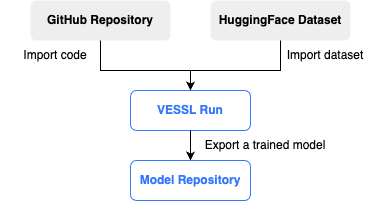
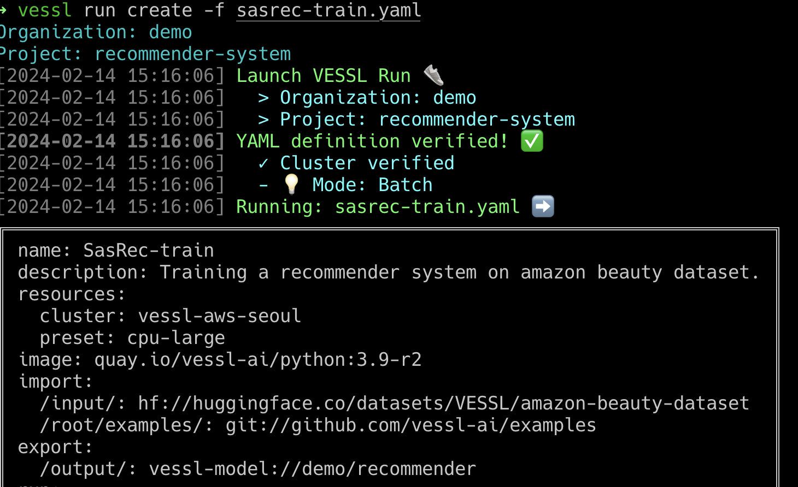
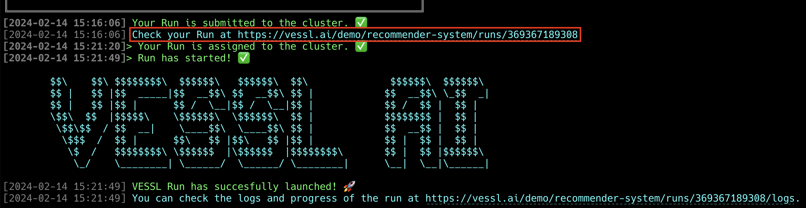
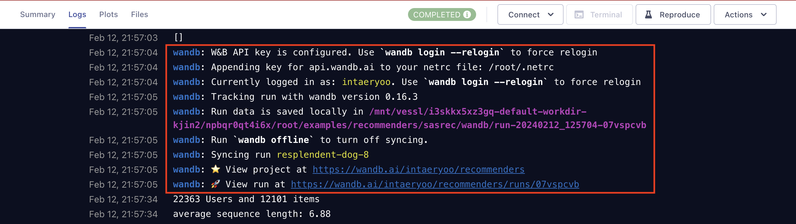
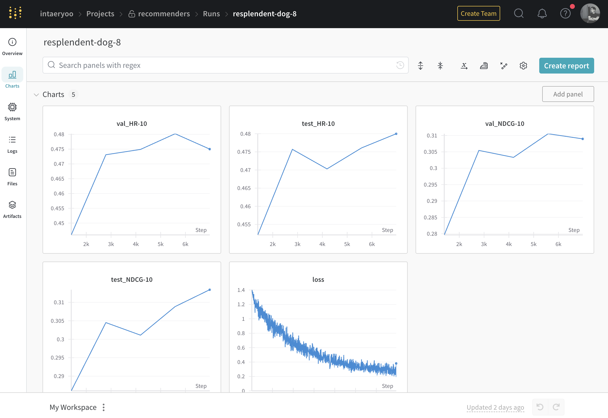
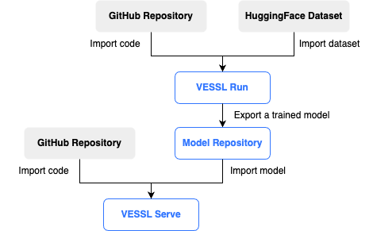
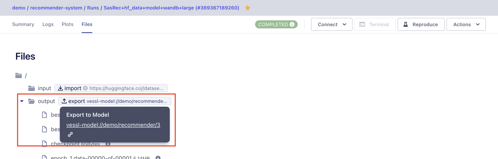
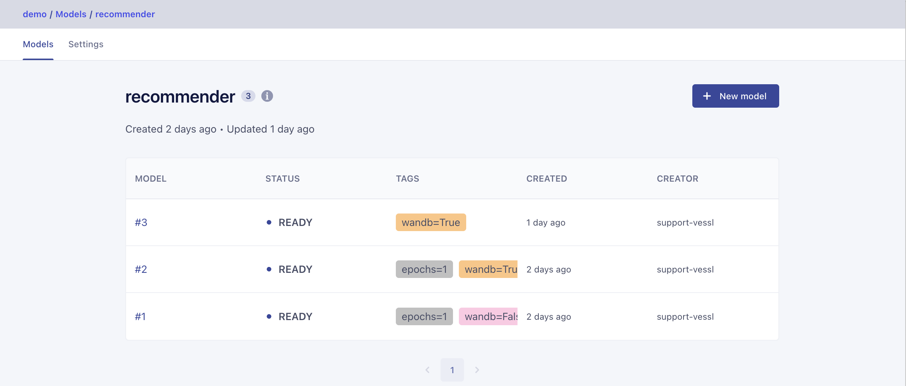
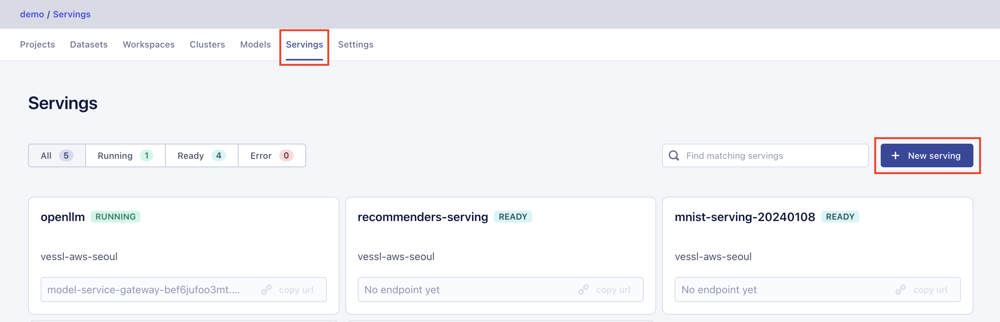
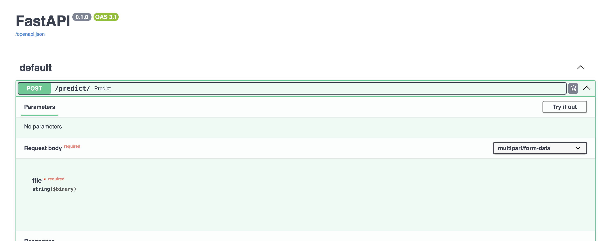

SasRec 모델 서빙을 위한 VESSL 활용 가이드
------

[](README.md) [](README-ko.md)

## 목차
0. [시작하기 전에](#시작하기-전에)
1. [VESSL Run을 이용한 추천 시스템 학습](#vessl-run을-이용한-추천-시스템-학습)
2. [VESSL Service를 이용한 온라인 추천 시스템 구축](#vessl-service를-이용한-온라인-추천-시스템-구축)
---

## 시작하기 전에

### VESSL CLI 설치 및 로그인 확인

시작하기에 앞서, 아래의 커맨드를 통해 [VESSL CLI](https://pypi.org/project/vessl/)가 설치되어 있으며, 올바르게 로그인되어 있는지 확인해주세요.

```sh
# VESSL CLI 설치
$ pip install vessl
   
# 로그인 상태 확인
$ vessl whoami

# 로그인이되어 있지 않다면, vessl configure 커맨드를 사용해서 로그인 진행
$ vessl configure
```
  
### VESSL 사용이 처음이신가요?

VESSL을 처음 사용하시는 경우,  [Quickstart](https://docs.vessl.ai/docs/en/get-started/quickstart) 가이드를 통해 기본적인 사용 방법을 익히는 것이 좋습니다.

---

## VESSL Run을 이용한 추천 시스템 학습

### 개요

이 예제는 [VESSL Run](https://docs.vessl.ai/)을 이용해서 [Recommenders](https://github.com/recommenders-team/recommenders) 패키지의 [SasRec 모델](https://arxiv.org/abs/1808.09781)을 학습하고, 모델 저장소에 결과를 저장하는 과정을 소개합니다. 학습에 사용되는 코드는 [sasrec/main.py](sasrec/main.py)에 있으며, 데이터셋으로는 HuggingFace에 공개된 [AWS Beauty Dataset](https://huggingface.co/datasets/VESSL/amazon-beauty-dataset)을 사용합니다.



### 사전준비

학습을 시작하기전, VESSL CLI를 사용하여 학습된 모델을 저장할 모델 저장소를 생성해야 합니다.

```sh
# 'recommender'라는 이름의 새 모델 저장소 생성
$ vessl model-repository create recommender

# 모델 저장소가 생성되었는지 확인
$ vessl model-repository list
```

### 학습

VESSL에서의 Run은 작업 실행을 위한 기본 단위로, 코드, 커맨드, AI 모델, 패키지, 환경 변수 등 필요한 모든 정보를 포함합니다. Run의 정의는 YAML 파일로 작성되며, 아래는 해당 예제에서 사용한 YAML 파일입니다.

> **참고**: 아래 YAML 파일에서 `{organizationName}`과 `{modelRepositoryName}`을 해당하는 값으로 교체해주세요.

```yaml
# sasrec-train.yaml
name: sasrec-train
description: Training a recommender system on amazon beauty dataset.
resources:
  cluster: vessl-aws-seoul
  preset: cpu-large
image: quay.io/vessl-ai/python:3.10-r18
import:
  /input/: hf://huggingface.co/datasets/VESSL/amazon-beauty-dataset
  /root/examples/: git://github.com/vessl-ai/examples
export:
  /output/: vessl-model://{organizationName}/{modelRepositoryName}
run:
  - workdir: /root/examples/recommenders/sasrec
    command: pip install -r requirements.txt
  - workdir: /root/examples/recommenders/sasrec
    command: python main.py
  - workdir: /root
    command: pip install --upgrade vessl
```

예제 폴더에 포함된 [sasrec-train.yaml](sasrec-train.yaml) 파일을 사용하여 Run을 생성해보세요.

```sh
vessl run create -f sasrec-train.yaml
```

위 명령어를 실행하면 다음과 같이 Run이 생성됩니다.



[sasrec-train.yaml](sasrec-train.yaml) 파일에는 모델 학습을 위한 필수 구성요소들이 정의되어 있습니다.
* **리소스 및 컨테이너 이미지 설정**: 사용할 리소스 및 컨테이너 이미지
* **코드를 가져오기 위한 GitHub repository 정보**:  `/root/examples`에 코드를 다운로드
* **데이터셋을 가져오기 위한 HuggingFace dataset 정보**: `/input`에 dataset을 다운로드
* **학습 완료한 모델을 저장할 저장소 정보**: `/output`에 저장된 데이터를 학습이 끝난후 모델 저장소로 업로드

### 웹 대시보드를 통한 학습 결과 확인 

Run이 성공적으로 생성되면, CLI를 통해 Run의 상태를 실시간으로 확인할 수 있는 웹 대시보드의 링크가 제공됩니다. 이 링크를 사용하면 VESSL 웹 인터페이스에서 직접 학습 과정과 결과를 모니터링 할 수 있습니다.



### (Optional) Wandb logging 사용하기

모델의 학습 중 다양한 지표를 추적하고 싶다면 [wandb](https://wandb.ai/)의 로깅 기능을 사용할 수 있습니다. 아래는 [sasrec-train-wandb.yaml](sasrec-train-wandb.yaml) 파일의 일부로, Weights & Biases에 로깅을 활성화 하는 방법을 보여줍니다.
YAML에서 `WANDB_KEY`와 같이 민감한 정보는 환경변수(`env`)로 아래에 `secret: true`로 지정해줍니다. 자세한 내용은 [VESSL Docs > YAML Reference](https://docs.vessl.ai/yaml-reference/en/yaml#environment-variables) 를 참고해주세요.
> **참고**: 아래 YAML 파일에서 `{YOUR_WANDB_KEY}` 값을 https://wandb.ai/authorize 에 출력되는 값으로 교체해주세요.
```yaml
name: SasRec-train-wandb
...
run:
  - ...
  - workdir: /root/examples/recommenders/sasrec
    command: python main.py --wandb-log True
  - ...
env:
  WANDB_KEY:
    value: {YOUR_WANDB_KEY}
    secret: true
```

### Wandb에서 학습 과정 추적하기

VESSL Run 로그에서 wandb 링크를 찾아 해당 링크를 통해 wandb 대시보드에서 학습 과정을 실시간으로 모니터링 할 수 있습니다. 이를 통해 모델의 성능 지표와 학습 과정을 효과적으로 분석하고 개선할 수 있습니다.


---

## VESSL Service를 이용한 온라인 추천 시스템 구축

### 개요 

이 예제에서는 [VESSL Service](https://docs.vessl.ai/guides/serve/overview)를 활용해 온라인으로 추천 모델을 서빙하는 과정을 소개합니다. 학습된 모델을 실시간 서비스 환경에 배포하여, 사용자 요청에 즉각적으로 추천 결과를 제공하는 방법을 단계별로 안내합니다.



### 학습된 모델 찾기

Run이 완료되어 모델 학습이 성공적으로 끝나면 `export` 항목에 지정한 모델 저장소 경로에 학습된 모델이 자동으로 업로드됩니다. Run 관련 정보를 웹 대시보드에서 확인할 수 있으며, Files 탭에서는 Run의 파일 구조를 트리 형태로 볼 수 있습니다. 여기서 `export` 경로로 링크를 통해 확인할 수 있습니다.



Files 탭에서 파일들을 로컬로 다운로드할 수 있으며, 링크를 통해 모델 저장소에 접근하여 저장된 모델을 확인할 수 있습니다.



CLI를 사용하여 모델 저장소에 저장된 모델의 리스트를 확인하거나 특정 모델의 파일 정보를 조회할 수도 있습니다.
```sh
# 'recommender' 모델 저장소에 저장된 모델 리스트를 조회
$ vessl model list recommender

# 'recommender' 모델 저장소의 특정 모델 (예: 3번 모델) 파일 정보 조회
$ vessl model list-files recommender 3
```

### 웹 대시보드에서 새로운 Service 생성하기

VESSL의 웹 대시보드의 Services 탭을 선택해 `+ New service` 버튼을 클릭하여 Service를 생성합니다.



생성된 Service는 CLI 명령어를 사용하여 확인할 수 있습니다.
```sh
# 생성된 service 리스트를 조회
$ vessl service list
```

### YAML을 이용해 새로운 Revision 생성하기

VESSL의 Service 기능은 코드, 커맨드, AI 모델, 패키지, 환경 변수, 오토스케일링, 포트 등 필요한 모든 정보를 포함합니다. Service의 정의는 YAML 파일로 정의됩니다. 아래는 SasRec 모델 서빙을 위한 예제 YAML 파일입니다.

```yaml
# sasrec-service.yaml
message: SasRec service from YAML
image: quay.io/vessl-ai/python:3.10-r18
resources:
  cluster: vessl-gcp-oregon
  preset: cpu-medium-spot
import:
  /model: vessl-model://vessl-ai/recommender/3
  /examples: git://github.com/vessl-ai/examples
run:
  - command: |-
      pip install -r requirements.serve.txt
      python serve.py --model-path $MODEL_PATH
    workdir: /examples/runs/recommenders/sasrec
env:
  MODEL_PATH: /model
ports:
  - port: 5000
    name: service
    type: http
service:
  expose: "5000"
  autoscaling:
    min: 1
    max: 3
    metric: cpu
    target: 60

```

예제 폴더에 포함된 [sasrec-service.yaml](sasrec-service.yaml) 파일을 사용하여 새로운 Service Revision을 생성하세요.

```sh
# 'recommenders-service' 이라는 service 생성
$ vessl service create --service-name recommenders-service -f sasrec-service.yaml

# 'recommenders-service' 이라는 service 조회
$ vessl service read --service recommenders-service --detail
```

API 서버가 정상적으로 작동하는지 확인하기 위해 `http://{API_ENDPOINT_URL}/docs` 로 이동하세요.



간단한 HTTP POST 요청으로 API 서버의 응답을 테스트합니다. 사용한 [test_amazon_beauty.csv](test_amazon_beauty.csv)은 구매한 상품 번호의 나열입니다.

```csv
# test_amazon_beauty.csv
1, 12, 123, 13, 5
```

```sh
$ curl -X 'POST' \
  'https://model-service-gateway-72fxbpvoqb3y.seoul.aws-cluster.vessl.ai/predict/' \
  -H 'accept: application/json' \
  -H 'Content-Type: multipart/form-data' \
  -F 'file=@test_amazon_beauty.csv;type=text/csv'

"item 2000"
```
