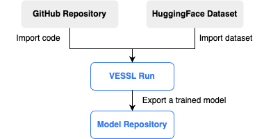
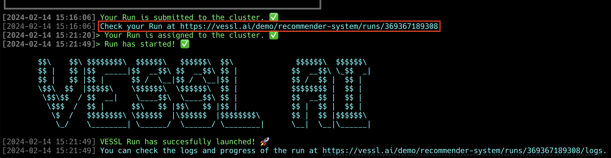
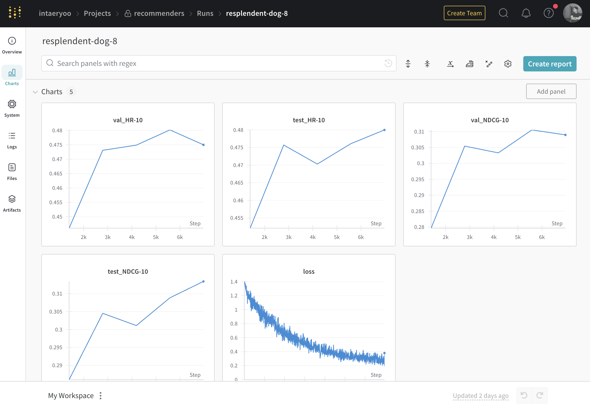
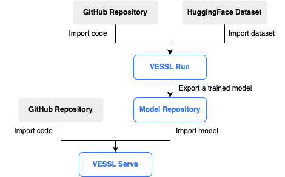
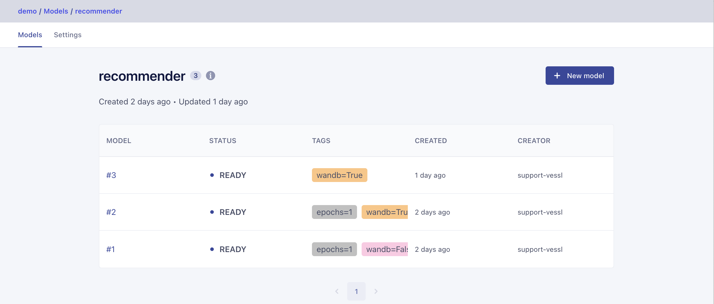

VESSL Guide for SasRec Model Serving
------

[](README.md) [](README-ko.md)


## Table of Contents
0. [Before You Start](#before-you-start)
1. [Training Recommender System with VESSL Run](#training-recommender-system-with-vessl-run)
2. [Building an Online Recommender System with VESSL Service](#building-an-online-recommender-system-with-vessl-service)
---

## Before You Start

### Installing and Checking VESSL CLI Login
Before starting, use the following commands to ensure the [VESSL CLI](https://pypi.org/project/vessl/) is installed, and you are correctly logged in.

```sh
# Install VESSL CLI
$ pip install vessl
   
# Check login status
$ vessl whoami

# If not logged in, proceed with login using the vessl configure command
$ vessl configure
```

### First Time Using VESSL?

If you're new to VESSL, it's recommended to familiarize yourself with the basic usage through the [Quickstart](https://docs.vessl.ai/docs/en/get-started/quickstart) guide.

---

## Training Recommender System with VESSL Run

### Overview

This example introduces the process of training the [SasRec model](https://arxiv.org/abs/1808.09781) from the [Recommenders](https://github.com/recommenders-team/recommenders) package using [VESSL Run](https://docs.vessl.ai/), and storing the results in a model repository. The training code is located at [sasrec/main.py](sasrec/main.py), and the dataset used is the [AWS Beauty Dataset](https://huggingface.co/datasets/VESSL/amazon-beauty-dataset) published on HuggingFace.



### Preparation

Before starting the training, use the VESSL CLI to create a model repository to store the trained model.

```sh
# Create a new model repository named 'recommender'
$ vessl model-repository create recommender

# Check if the model repository was created
$ vessl model-repository list 
```

### Training

In VESSL, a Run is the basic unit for executing tasks, including all necessary information such as code, commands, AI models, packages, environment variables, etc. The definition of a Run is written in a YAML file, as shown below in the example used.

> **Note**: In the YAML file below, replace `{organizationName}` and `{modelRepositoryName}` with the appropriate values.

```yaml
# sasrec-train.yaml
name: sasrec-train
description: Training a recommender system on amazon beauty dataset.
resources:  
  cluster: vessl-aws-seoul
  preset: cpu-large
image: quay.io/vessl-ai/python:3.10-r18
import:  
  /input/: hf://huggingface.co/datasets/VESSL/amazon-beauty-dataset
  /root/examples/: git://github.com/vessl-ai/examples
export:  
  /output/: vessl-model://{organizationName}/{modelRepositoryName}
run:
  - workdir: /root/examples/recommenders/sasrec
    command: pip install -r requirements.txt
  - workdir: /root/examples/recommenders/sasrec
    command: python main.py
  - workdir: /root
    command: pip install --upgrade vessl
```

Use the [sasrec-train.yaml](sasrec-train.yaml) file included in the example folder to create a Run.

```sh
vessl run create -f sasrec-train.yaml
```
Executing the above command will create a Run as shown below.


The [sasrec-train.yaml](sasrec-train.yaml) file defines essential components for model training:
* **Resource and Container Image Settings**: Specifies the resources and container image to use.
* **GitHub Repository Information for Code Import**: Downloads code to `/root/examples`.
* **HuggingFace Dataset Information for Data Import**: Downloads dataset to `/input`.
* **Repository Information for Storing the Trained Model**: Uploads stored data in `/output` to the model repository after training is completed.

### Checking Training Results via the Web Dashboard

Once a Run is successfully created, a web dashboard link to monitor the status of the Run in real-time is provided through the CLI. This link allows direct monitoring of the training process and results through the VESSL web interface.



### (Optional) Using Wandb Logging

To track various metrics during model training, you can use the logging feature of [wandb]((https://wandb.ai/)). The part of the [sasrec-train-wandb.yaml](sasrec-train-wandb.yaml) file below demonstrates how to activate logging to Weights & Biases.
Sensitive information like `WANDB_KEY` should be specified as an environment variable (`env`) with `secret: true`. For more details, refer to [VESSL Docs > YAML Reference](https://docs.vessl.ai/yaml-reference/en/yaml#environment-variables).

> **Note**: Replace `{YOUR_WANDB_KEY}` in the YAML file below with the value from https://wandb.ai/authorize.

```yaml
name: SasRec-train-wandb
...
run:
  - ... 
  - workdir: /root/examples/recommenders/sasrec
    command: python main.py --wandb-log True
  - ...
env:
  WANDB_KEY:
    value: {YOUR_WANDB_KEY}
    secret: true
```
### Tracking Training Process with Wandb

You can monitor the training process in real-time on the wandb dashboard by finding the wandb link in the VESSL Run log. This allows effective analysis and improvement of the model's performance metrics and training process.




---

## Building an Online Recommender System with VESSL Service

### Overview

This example introduces the process of serving the trained recommender model online using [VESSL Service](https://docs.vessl.ai/guides/serve/overview). The trained model is deployed in a real-time service environment to provide immediate recommendation results in response to user requests, guided step-by-step.



### Finding the Trained Model

After the Run completes and the model training successfully finishes, the trained model is automatically uploaded to the model repository path specified in the `export` item. You can check Run-related information on the web dashboard, and in the Files tab, the file structure of the Run can be seen in a tree format. The `export` path can also be accessed through a link.


Files in the Files tab can be downloaded locally, and through the link, you can access the model repository to see the stored models.



You can also use the CLI to check the list of models stored in the model repository or to query file information of a specific model (e.g., model number 3).

```sh
# List models stored in the 'recommender' model repository
$ vessl model list recommender

# Query file information of a specific model (e.g., model number 3) in the 'recommender' model repository
$ vessl model list-files recommender 3
```

### Creating a New Service from the Web Dashboard

Select the Services tab in VESSL's web dashboard and click the `+ New service` button to create a Service.

The created Services can be verified using the following CLI command:

```sh
# List created servings
$ vessl service list
```

### Creating a New Revision with YAML

VESSL Service includes all necessary information such as code, commands, AI models, packages, environment variables, autoscaling, ports, etc. The Serve definition is provided in a YAML file. Below is an example YAML file for serving the SasRec model.

```yaml
# sasrec-service.yaml
message: SasRec service from YAML
image: quay.io/vessl-ai/python:3.10-r18
resources:
  cluster: vessl-gcp-oregon
  preset: cpu-medium-spot
import:
  /model: vessl-model://vessl-ai/recommender/3
  /examples: git://github.com/vessl-ai/examples
run:
  - command: |-
      pip install -r requirements.serve.txt
      python serve.py --model-path $MODEL_PATH
    workdir: /examples/runs/recommenders/sasrec
env:
  MODEL_PATH: /model
ports:
  - port: 5000
    name: service
    type: http
service:
  expose: "5000"
  autoscaling:
    min: 1
    max: 3
    metric: cpu
    target: 60

```

Use the [sasrec-service.yaml](sasrec-service.yaml) file included in the example folder to create a new Service Revision.

```sh
# Create a new revision for 'recommenders-services' service
$ vessl service create --service-name recommenders-service -f sasrec-service.yaml

# Show the information of 'recommenders-serving' service
$ vessl service read --service recommenders-service --detail
```

To check if the API server is functioning properly, navigate to `http://{API_ENDPOINT_URL}/docs`.


Test the API server's response with a simple HTTP POST request. The used [test_amazon_beauty.csv](test_amazon_beauty.csv) is a simple list of purchased product numbers.

```csv
# test_amazon_beauty.csv
1, 12, 123, 13, 5
```

```sh
$ curl -X 'POST' \
  'https://model-service-gateway-72fxbpvoqb3y.seoul.aws-cluster.vessl.ai/predict/' \
  -H 'accept: application/json' \
  -H 'Content-Type: multipart/form-data' \
  -F 'file=@test_amazon_beauty.csv;type=text/csv'
  
"item 2000"
```
