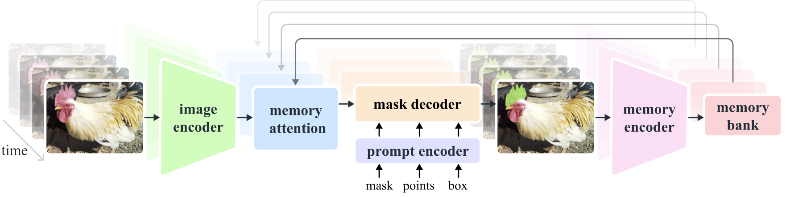
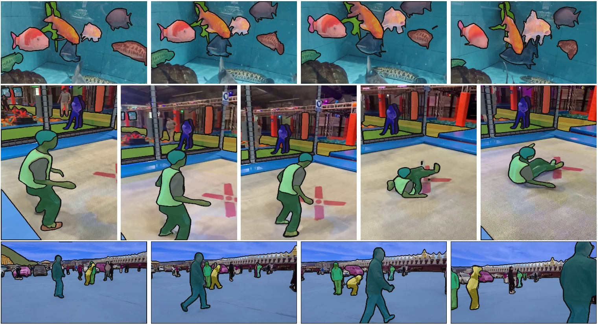

# SAM 2: Segment Anything in Images and Videos

This repository contains code to run a sample Gradio app for [Segment Anything Model 2](https://github.com/facebookresearch/segment-anything-2) (SAM 2), a foundation model towards solving promptable visual segmentation in images and videos.

SAM 2 is a simple transformer architecture with streaming memory for real-time video processing. SAM 2 trained on [SA-V Dataset](https://ai.meta.com/datasets/segment-anything-video/) provides strong performance across a wide range of tasks. In video segmentation, it shows better accuracy, using 3x fewer interactions than prior approaches. In image segmentation, SAM 2 is more accurate and 6x faster than the Segment Anything Model (SAM).



## Running Locally
***Note:** You have to use a GPU machine with CUDA to install SAM 2.*

1. Clone the [SAM 2 repository](https://github.com/facebookresearch/segment-anything-2) and follow the **installation** and **download checkpoints** instructions.

2. Clone this repository:
    ```sh
    $ git clone https://github.com/vessl-ai/examples.git
    $ cd examples/runs/segment-anything-2
    ```

3. Install Gradio:
    ```sh
    $ pip install gradio==4.41.0
    ```

4. Run the application:
    ```sh
    $ python app.py
    ```

5. Access the Gradio interface by opening http://localhost:7860 in your web browser.

## Deploying with VESSL Run
VESSL is a platform for deploying and managing AI applications. It allows you to deploy your AI applications on the cloud with a single command, and provides a web interface for managing your applications.

To deploy the SAM 2 Gradio app, follow the steps below:

1. Install VESSL CLI and configure your identity:
    ```sh
    $ pip install --upgrade vessl
    $ vessl configure
    ```
2. (Optional) Create a new project (replace `${PROJECT_NAME}` with the name you want):
    ```sh
    $ vessl project create ${PROJECT_NAME}
    $ vessl configure -p ${PROJECT_NAME}
    ```
3. Clone this repository:
    ```sh
    $ git clone https://github.com/vessl-ai/examples.git
    $ cd examples/runs/segment-anything-2
    ```
4. Deploy the application with the provided YAML file ([`run.yaml`](./run.yaml)):
    ```sh
    $ vessl run create -f run.yaml
    ```

For additional information and support, please refer to the [VESSL documentation](https://docs.vessl.ai).

## Citation
```bibtex
@article{ravi2024sam2,
  title={SAM 2: Segment Anything in Images and Videos},
  author={Ravi, Nikhila and Gabeur, Valentin and Hu, Yuan-Ting and Hu, Ronghang and Ryali, Chaitanya and Ma, Tengyu and Khedr, Haitham and R{\"a}dle, Roman and Rolland, Chloe and Gustafson, Laura and Mintun, Eric and Pan, Junting and Alwala, Kalyan Vasudev and Carion, Nicolas and Wu, Chao-Yuan and Girshick, Ross and Doll{\'a}r, Piotr and Feichtenhofer, Christoph},
  journal={arXiv preprint arXiv:2408.00714},
  url={https://arxiv.org/abs/2408.00714},
  year={2024}
}
```