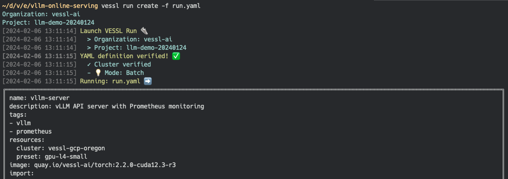
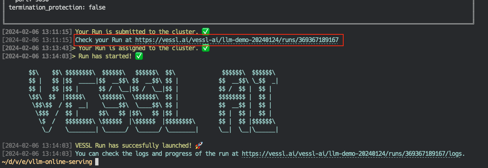
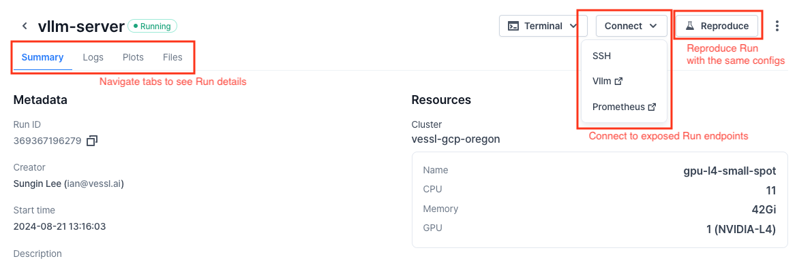
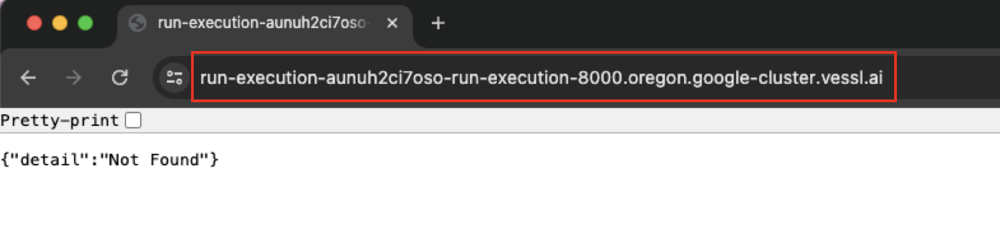
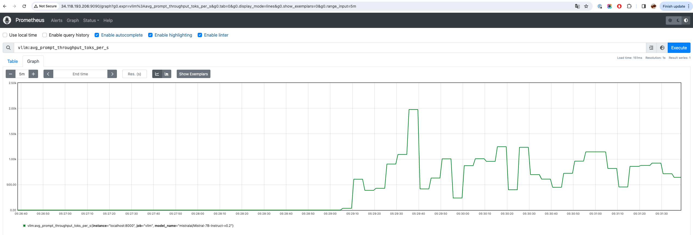
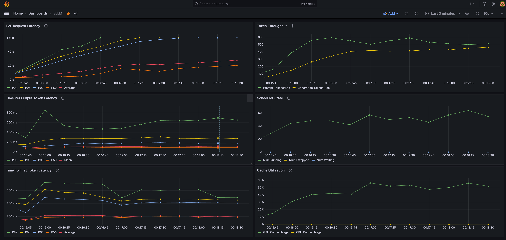
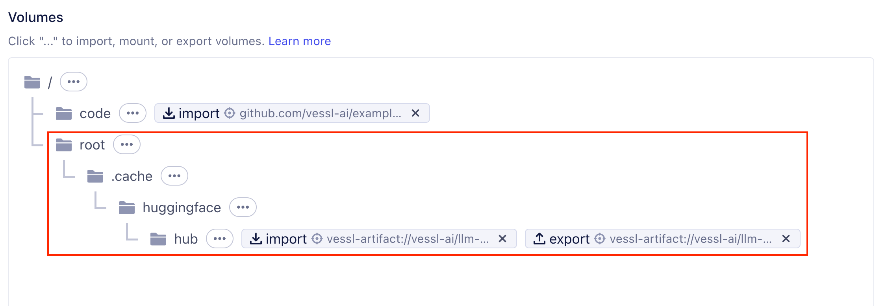

# LLM Inference with vLLM and VESSL Run (한글 문서)
------

[](README.md) [](README-ko.md)

이 문서는 VESSL Run과 vLLM을 이용하여 LLM을 더 빠르게 추론할 수 있는 모델 API를 만드는 방법을 설명합니다.
* [VESSL Run](https://docs.vessl.ai/) 은 AI 모델을 빠르게 빌드하고 배포할 수 있는 플랫폼입니다.
* [vLLM](https://vllm.ai/) 은 [PagedAttention](https://arxiv.org/pdf/2309.06180.pdf) 등의 기술을 기반으로 LLM 추론의 성능을 크게 높일 수 있는 라이브러리입니다.

> **Note**:
> * 시작하기 전 CLI 환경에서 아래 커맨드를 실행하여 VESSL에 잘 로그인되었는지 확인해주세요:
>   ```sh
>   # Check if you are logged in
>   vessl whoami
> 
>   # If not, configure VESSL CLI with your VESSL credentials
>   vessl configure
>   ```
> * VESSL Run은 단일 컨테이너에서 노트북, 학습, 추론 서비스 등을 실행하기 위한 기능입니다. Autoscaling이나 Load Balancing 등 Production-level AI 서비스에 필요한 기능을 함께 사용하기 위해서는 [VESSL Serve](https://docs.vessl.ai/user-guide/serve)를 참고해주세요.

## Deploying vLLM server with VESSL Run

VESSL에서 Run은 태스크 실행의 기본 단위입니다. Run의 정의에는 코드, 커맨드, AI 모델, 패키지, 환경 변수 등 각종 작업을 실행하기 위한 정보가 포함됩니다. 

Run의 정의는 YAML 파일로 작성됩니다. 예를 들면, 이번 예제의 YAML 파일 중 일부를 아래와 같이 작성할 수 있습니다:

> `meta-llama/Meta-Llama-3.1-8B-Instruct` 등 사전 승인이 필요한 모델을 사용할 경우, Run 실행 전에 `HF_TOKEN`을 자신의 허깅페이스 API 토큰으로 변경해야 합니다. 허깅페이스 API 토큰을 발급받는 방법에 대해서는 [허깅페이스 공식 문서](https://huggingface.co/docs/api-inference/en/quicktour#get-your-api-token)를 참고해 주시기 바랍니다.
> 본 예시에서는 성능과 접근성을 위해 Llama 3.1 8B를 AWQ 양자화한 모델인 [`hugging-quants/Meta-Llama-3.1-8B-Instruct-AWQ-INT4`](https://huggingface.co/hugging-quants/Meta-Llama-3.1-8B-Instruct-AWQ-INT4)을 사용하였습니다.

```yaml
# vllm-run.yaml
name: vllm-server
description: LLM server with vLLM and Prometheus monitoring
tags:
  - vllm
resources: # Resource requirements
  cluster: vessl-gcp-oregon
  preset: gpu-l4-small-spot
image: quay.io/vessl-ai/torch:2.3.1-cuda12.1-r5 # Container image
import: # Code, data, or model to import
  /code/:
    git:
      url: github.com/vessl-ai/examples.git
      ref: main
run:
  - command: |- # Command to run the API server
      ...
    workdir: /code/vllm-run
ports: # Endpoint configuration
  - name: vllm
    type: http
    port: 8000
  - name: prometheus
    type: http
    port: 9090
env: # Environment variables
  MODEL_NAME: hugging-quants/Meta-Llama-3.1-8B-Instruct-AWQ-INT4
  HF_TOKEN: HF_TOKEN # Your Huggingface API token
```

[vllm-run.yaml](vllm-run.yaml) 파일에는 아래 내용들이 정의되어 있습니다:
* 사용할 리소스 및 컨테이너 이미지
* 코드를 가져오기 위한 git repository 정보
* 모니터링 도구 Prometheus를 실행하기 위한 커맨드
* vLLM 기반의 LLM API 서버를 실행하기 위한 커맨드
* API 서버와 Prometheus의 endpoint를 연결하기 위한 설정

예제 폴더에 포함된 [vllm-run.yaml](vllm-run.yaml) 파일을 사용하여 Run을 생성해봅니다.

```sh
vessl run create -f vllm-run.yaml
```

위 명령어를 실행하면 아래 스크린샷과 같이 Run이 생성됩니다.



> **Note**: Run을 생성하는 방법에 대한 자세한 내용은 [VESSL Run Quickstart](https://docs.vessl.ai/guides/get-started/quickstart)를 참고해주세요!

## Accessing VESSL Run with Web Dashboard 

Run이 생성된 후, CLI 환경에서 아래와 같이 Run의 상태를 확인할 수 있는 Web Dashboard의 링크를 확인할 수 있습니다.



대시보드에서 Run의 세부 정보, 연결된 서비스 엔드포인트 등을 확인할 수 있고, 버튼 한 번으로 Run을 쉽게 재현할 수 있습니다.



## Testing the API

Run Dashboard에서 Connect -> `vllm` 을 선택해서 API endpoint로 이동합니다. 웹 브라우저의 주소창에 있는 URL (`API_ENDPOINT_URL`)을 확인하실 수 있습니다.



API 테스트를 위해 작성한 간단한 파이썬 스크립트([`api-test.py`](api-test.py))를 이용하여 API 서버가 잘 작동하는지 확인해 봅니다. `{API_KEY}`를 위의 Run YAML 파일에서 지정한 API 키로 변경해야 합니다.

```sh
$ python vllm-run/api-test.py \
    --base-url https://{API_ENDPOINT_URL} \
    --model-name hugging-quants/Meta-Llama-3.1-8B-Instruct-AWQ-INT4

ChatCompletionMessage(content='The capital of South Korea is Seoul.', role='assistant', function_call=None, tool_calls=[])
```

## Advanced: Benchmarking API server

`vLLM` 은 Prometheus 기반으로 LLM 서비스의 모니터링에 필요한 주요 지표들을 수집할 수 있는 기능을 제공합니다. vLLM 서비스가 제공하는 지표들의 예시는 다음과 같습니다.
* E2E request latency: API 서버에 요청을 보내고 응답을 받는데 걸리는 시간
* Token throughput: 초당 처리/생성하는 토큰의 수
* Time per first token: 요청을 받아 첫 번째 토큰을 생성하는데 걸리는 시간
* Cache utilization: GPU VRAM 내의 KV cache에 저장된 데이터를 사용하는 비율

로컬 환경에서 아래와 같이 vLLM을 설치하고, benchmark 스크립트를 실행하여 API 서버의 성능을 확인할 수 있습니다.

```sh
# Install vLLM and required dependencies
# You might need CUDA available on your local environment to install vLLM
pip install aiohttp vllm

# Clone the vLLM repository (which contains benchmark script)
git clone https://github.com/vllm-project/vllm

# Get sample prompt for benchmarking
wget https://huggingface.co/datasets/anon8231489123/ShareGPT_Vicuna_unfiltered/resolve/main/ShareGPT_V3_unfiltered_cleaned_split.json

# Run the benchmark script
python vllm/benchmarks/benchmark_serving.py \
  --backend vllm \
  --base-url https://{API_ENDPOINT_URL} \
  --model hugging-quants/Meta-Llama-3.1-8B-Instruct-AWQ-INT4 \
  --request-rate 3 \
  --dataset-path ShareGPT_V3_unfiltered_cleaned_split.json 
```

위에서 실행한 Run에는 Prometheus가 이미 실행되고 있습니다. Run Dashboard에서 Connect -> `prometheus` 을 선택해서 접속하여 Prometheus UI와 API 서버의 각종 지표를 확인하실 수 있습니다.



Prometheus source를 Grafana에 연결하여 아래와 같이 더 직관적으로 시각화된 대시보드를 구축할 수도 있습니다.\
더 자세한 내용은 [vLLM의 공식 문서](https://github.com/vllm-project/vllm/tree/main/examples/production_monitoring)를 참고해주세요!




## Cleaning up

`vessl run terminate` 커맨드를 사용하여 실행중인 Run을 종료할 수 있습니다.

```sh
# List runs to find the ID of the run to terminate
$ vessl run list

Organization: vessl-ai
Project: llm-demo-20240124
 ID            Name           Type         Status      Created                    Description
 ............  rag-chatbot    batch        terminated  2024-01-25 01:37:52+00:00
 ............  rag-chatbot    interactive  terminated  2024-01-25 01:47:11+00:00
 ............  vllm-server    batch        terminated  2024-02-05 14:37:27+00:00
 ............  test-notebook  interactive  terminated  2024-02-05 14:47:10+00:00
 369367189168  vllm-server    batch        running     2024-02-06 04:16:36+00:00

# Terminate the run
$ vessl run terminate 369367189168

Organization: vessl-ai
Project: llm-demo-20240124
Terminated '#369367189168'.
```

Web dashboard에서 오른쪽 상단 줄임표(`...`) -> Terminate을 클릭하여도 Run을 종료할 수 있습니다.


## Advanced Topics for Faster Deployment

예제에서는 파일 하나로 쉽게 VESSL Run을 생성하고 endpoint를 확인하는 방법을 설명했습니다. 제공된 예제보다 Run을 더 빠르게 실행하고 싶을 때 적용할 수 있는 몇 가지 방법들을 소개합니다.

### Build a custom Docker image for faster Run turn-up

Run을 실행하는 과정에서 Prometheus와 vLLM 설치 등 초기화 작업을 수행하는 것을 로그에서 확인하실 수 있습니다. 이러한 초기화 작업을 Docker 이미지에 포함시켜서 Run을 더 빠르게 실행할 수 있습니다.

아래는 각종 dependency를 포함한 Docker 이미지를 빌드하는 예시입니다.

```Dockerfile
FROM quay.io/vessl-ai/torch:2.2.0-cuda12.3-r3

ENV PROMETHEUS_VERSION=2.49.1
ENV MODEL_NAME=casperhansen/llama-3-8b-instruct-awq

WORKDIR /app

# Download and unzip prometheus binary to /app/prometheus
RUN wget https://github.com/prometheus/prometheus/releases/download/v$PROMETHEUS_VERSION/prometheus-$PROMETHEUS_VERSION.linux-amd64.tar.gz
RUN tar -xvf prometheus-$PROMETHEUS_VERSION.linux-amd64.tar.gz
RUN mv prometheus-$PROMETHEUS_VERSION.linux-amd64 ./prometheus
RUN rm prometheus-$PROMETHEUS_VERSION.linux-amd64.tar.gz

# Copy prometheus.yml
COPY monitoring/prometheus.yml /app/prometheus/prometheus.yml

# Install dependencies
RUN pip install autoawq==0.2.6
RUN pip install vllm==0.5.4
RUN pip uninstall -y transformer-engine
RUN pip install flash-attn==2.6.3
RUN vllm serve $MODEL_NAME --max-model-len 65536 --disable-frontend-multiprocessing

# Entrypoint
ENTRYPOINT vllm serve $MODEL_NAME --max-model-len 65536 --disable-frontend-multiprocessing
```

### Caching `~/.cache/huggingface` for faster model loading

예제에서는 HuggingFace의 모델을 사용하고 있습니다. HuggingFace의 모델은 처음 로딩할 때 다운로드를 받아야 하기 때문에, 처음 로딩하는데 시간이 소요됩니다. 이러한 시간을 줄이기 위해서 `~/.cache/huggingface` 디렉토리를 미리 캐싱해둘 수 있습니다.

VESSL Artifacts를 사용하여 아래와 같이 `~/.cache/huggingface` 디렉토리를 캐싱할 수 있습니다. Run이 종료될 때 해당 디렉토리를 Artifacts로 저장하고, 다음 Run에서는 Artifacts를 다시 불러와서 사용할 수 있습니다.



YAML manifest에서는 `import` 와 `export` 영역이 아래와 같이 추가됩니다.

```yaml
import:
  ...
  /root/.cache/huggingface/: vessl-artifact://{ORGANIZATION}/{PROJECT}/huggingface-models
export:
  /root/.cache/huggingface/: vessl-artifact://{ORGANIZATION}/{PROJECT}/huggingface-models

```

같은 방법으로 HuggingFace뿐만 아니라 필요한 라이브러리, 모델 등을 VESSL Artifact에 캐싱하여 사용할 수 있습니다.

## Citation

```bibtex
@inproceedings{kwon2023efficient,
  title={Efficient Memory Management for Large Language Model Serving with PagedAttention},
  author={Woosuk Kwon and Zhuohan Li and Siyuan Zhuang and Ying Sheng and Lianmin Zheng and Cody Hao Yu and Joseph E. Gonzalez and Hao Zhang and Ion Stoica},
  booktitle={Proceedings of the ACM SIGOPS 29th Symposium on Operating Systems Principles},
  year={2023}
}
```
