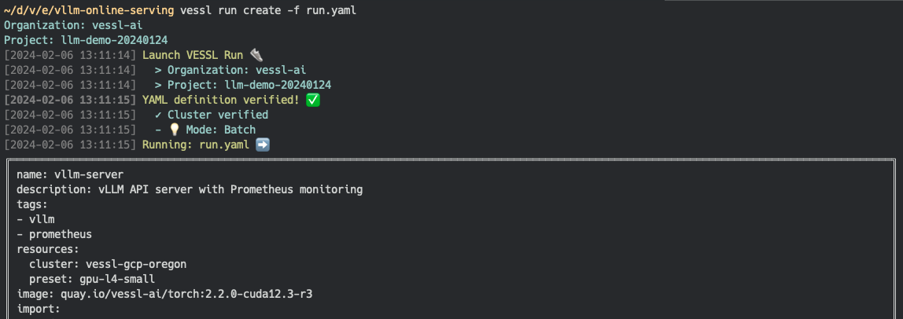
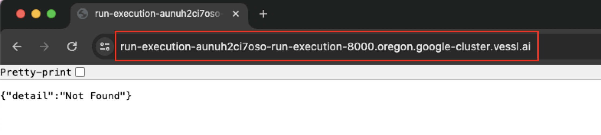
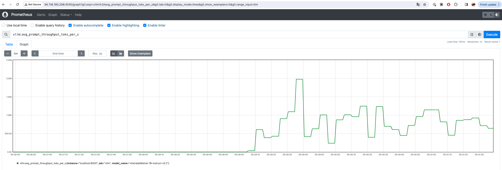
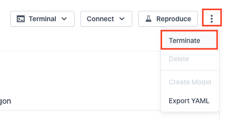

# Online Serving with vLLM and VESSL Run

[](README.md) [](README-ko.md)

This document outlines how to deploy a fast and efficient LLM API using VESSL Run and vLLM.
* [VESSL Run](https://docs.vessl.ai/) is a platform that enables easy building and deployment of AI models.
* [vLLM](https://vllm.ai/) is a library enhancing LLM inference performance, based on technologies like [PagedAttention](https://arxiv.org/pdf/2309.06180.pdf).

> **Note**:
> * Before starting, ensure you're logged into VESSL by running the following commands in the CLI environment:
>   ```sh
>   # Check if you are logged in
>   vessl whoami
> 
>   # If not, configure VESSL CLI with your VESSL credentials
>   vessl configure
>   ```
> * VESSL Run provides functionality to execute notebooks, training or inference services in a **single** container. For Production-level AI services that require features like Autoscaling or Load Balancing, please refer to [VESSL Serve](https://docs.vessl.ai/user-guide/serve).

## Deploying vLLM Server with VESSL Run

**Run** is the basic unit for task execution in VESSL. A Run's definition includes various details needed to execute a task such as code, commands, AI models, packages, environment variables, etc.


The definition of a Run is written in a YAML file. For instance, here is a snippet of the YAML file for this example:

> If you want to use a gated model such as `meta-llama/Meta-Llama-3.1-8B-Instruct`, you have to replace `HF_TOKEN` with your own Huggingface API token. Please refer to the [Huggingface official document](https://huggingface.co/docs/api-inference/en/quicktour#get-your-api-token) if you don't know how to get an API token.
> In this example, [`hugging-quants/Meta-Llama-3.1-8B-Instruct-AWQ-INT4`](https://huggingface.co/hugging-quants/Meta-Llama-3.1-8B-Instruct-AWQ-INT4), a quantized Llama 3.1 8B model is used for perfomance and accessibility.

```yaml
# vllm-run.yaml
name: vllm-server
description: LLM server with vLLM and Prometheus monitoring
tags:
  - vllm
resources: # Resource requirements
  cluster: vessl-gcp-oregon
  preset: gpu-l4-small-spot
image: quay.io/vessl-ai/torch:2.3.1-cuda12.1-r5 # Container image
import: # Code, data, or model to import
  /code/:
    git:
      url: github.com/vessl-ai/examples.git
      ref: main
run:
  - command: |- # Command to run the API server
      ...
    workdir: /code/vllm-run
ports: # Endpoint configuration
  - name: vllm
    type: http
    port: 8000
  - name: prometheus
    type: http
    port: 9090
env: # Environment variables
  MODEL_NAME: hugging-quants/Meta-Llama-3.1-8B-Instruct-AWQ-INT4
  HF_TOKEN: HF_TOKEN # Your Huggingface API token
```
This [vllm-run.yaml](vllm-run.yaml) file defines the following:
* The resources and container image to be used
* Git repository information for importing code
* Commands to run the monitoring tool Prometheus
* Commands to run a vLLM-based LLM API server
* Configuration to connect the API server and Prometheus endpoints

To create a Run, Use `vessl run` command with the YAML file.

```sh
vessl run create -f vllm-run.yaml
```

Executing the above command will create a Run as shown in the screenshot below.




> **Note**: For detailed instructions on creating a Run, please refer to the [VESSL Run Quickstart](https://docs.vessl.ai/guides/get-started/quickstart)!

## Accessing VESSL Run with Web Dashboard

After a Run is created, you can find the link to the Web Dashboard, where you can check the status of the Run, in the CLI environment as shown below.


The dashboard allows you to view detailed information about the Run, connected service endpoints, and easily replicate the Run with a single button click.


## Testing the API

Select Connect -> `vllm` in the Run Dashboard to navigate to the API endpoint. You can find the URL (`API_ENDPOINT_URL`) in the address bar of your web browser.



Run a simple python script([`api-test.py`](api-test.py)) to test if the API server is operating correctly. Replace `{API_KEY}` with the API key configured in the Run YAML file.

```sh
$ python vllm-run/api-test.py \
    --base-url https://{API_ENDPOINT_URL} \
    --model-name hugging-quants/Meta-Llama-3.1-8B-Instruct-AWQ-INT4

ChatCompletionMessage(content='The capital of South Korea is Seoul.', role='assistant', function_call=None, tool_calls=[])
```

## Advanced: Benchmarking the API Server

`vLLM` provides the capability to collect key metrics necessary for monitoring LLM services based on Prometheus. Examples of metrics provided by the vLLM service include:
* E2E request latency: The time taken to send a request to the API server and receive a response
* Token throughput: The number of tokens processed/generated per second
* Time per first token: The time taken from receiving a request to generating the first token
* Cache utilization: The percentage of data stored in the GPU VRAM's KV cache that is utilized

You can run the benchmark script on your local environment to evaluate the performance of the API server as follows.

```sh
# Install vLLM and required dependencies
# You might need CUDA available on your local environment to install vLLM
pip install aiohttp vllm

# Clone the vLLM repository (which contains benchmark script)
git clone https://github.com/vllm-project/vllm

# Get sample prompt for benchmarking
wget https://huggingface.co/datasets/anon8231489123/ShareGPT_Vicuna_unfiltered/resolve/main/ShareGPT_V3_unfiltered_cleaned_split.json

# Run the benchmark script
python vllm/benchmarks/benchmark_serving.py \
  --backend vllm \
  --base-url https://{API_ENDPOINT_URL} \
  --model hugging-quants/Meta-Llama-3.1-8B-Instruct-AWQ-INT4 \
  --request-rate 3 \
  --dataset-path ShareGPT_V3_unfiltered_cleaned_split.json 
```

Prometheus is already running in the Run you initiated earlier. You can access Prometheus by selecting Connect -> `prometheus` in the Run Dashboard to view various metrics in the Prometheus UI and API server.



You can also connect the Prometheus source to Grafana to build a more intuitive, visualized dashboard as shown below.\
For more details, please refer to [the official vLLM documentation](https://github.com/vllm-project/vllm/tree/main/examples/production_monitoring)!


## Cleaning Up

You can terminate a running Run using the `vessl run terminate` command.

```sh
# List runs to find the ID of the run to terminate
$ vessl run list

Organization: vessl-ai
Project: llm-demo-20240124
 ID            Name           Type         Status      Created                    Description
 ............  rag-chatbot    batch        terminated  2024-01-25 01:37:52+00:00
 ............  rag-chatbot    interactive  terminated  2024-01-25 01:47:11+00:00
 ............  vllm-server    batch        terminated  2024-02-05 14:37:27+00:00
 ............  test-notebook  interactive  terminated  2024-02-05 14:47:10+00:00
 369367189168  vllm-server    batch        running     2024-02-06 04:16:36+00:00

# Terminate the run
$ vessl run terminate 369367189168

Organization: vessl-ai
Project: llm-demo-20240124
Terminated '#369367189168'.
```

You can also terminate the Run by clicking ellipsis(`...`) -> Terminate in the top right corner of the Web dashboard.



## Advanced Topics for Faster Deployment

The example describes a straightforward method to create a VESSL Run and check the endpoint using a single file. Here are some approaches you can apply to expedite the execution of Runs beyond the provided example.

### Build a Custom Docker Image for Faster Run Turn-Up

During the Run execution process, you can observe initialization tasks such as the installation of Prometheus and vLLM in the logs. Including these initialization tasks in the Docker image can speed up Run execution.

Below is an example of building a Docker image that includes various dependencies.

```Dockerfile
FROM quay.io/vessl-ai/torch:2.3.1-cuda12.1-r5

ENV PROMETHEUS_VERSION=2.49.1
ENV MODEL_NAME=hugging-quants/Meta-Llama-3.1-8B-Instruct-AWQ-INT4

WORKDIR /app

# Download and unzip prometheus binary to /app/prometheus
RUN wget https://github.com/prometheus/prometheus/releases/download/v$PROMETHEUS_VERSION/prometheus-$PROMETHEUS_VERSION.linux-amd64.tar.gz
RUN tar -xvf prometheus-$PROMETHEUS_VERSION.linux-amd64.tar.gz
RUN mv prometheus-$PROMETHEUS_VERSION.linux-amd64 ./prometheus
RUN rm prometheus-$PROMETHEUS_VERSION.linux-amd64.tar.gz

# Copy prometheus.yml
COPY monitoring/prometheus.yml /app/prometheus/prometheus.yml

# Install dependencies
RUN pip install autoawq==0.2.6
RUN pip install vllm==0.5.4
RUN pip uninstall -y transformer-engine
RUN pip install flash-attn==2.6.3
RUN vllm serve $MODEL_NAME --max-model-len 65536 --disable-frontend-multiprocessing

# Entrypoint
ENTRYPOINT vllm serve $MODEL_NAME --max-model-len 65536 --disable-frontend-multiprocessing
```

### Caching `~/.cache/huggingface` for Faster Model Loading

The example uses models from HuggingFace, which require downloading upon the first load, thus taking time. Pre-caching the `~/.cache/huggingface` directory can reduce this loading time.

You can cache the `~/.cache/huggingface` directory using VESSL Artifacts as follows. The directory is saved as Artifacts when the Run terminates, and can be reused in subsequent Runs.


The YAML manifest will include additional `import` and `export` sections as shown below.

```yaml
import:
  ...
  /root/.cache/huggingface/: vessl-artifact://{ORGANIZATION}/{PROJECT}/huggingface-models
export:
  /root/.cache/huggingface/: vessl-artifact://{ORGANIZATION}/{PROJECT}/huggingface-models

```

This method can be applied not only to HuggingFace but also to caching necessary libraries, models, etc., using VESSL Artifact.

## Citation

```bibtex
@inproceedings{kwon2023efficient,
  title={Efficient Memory Management for Large Language Model Serving with PagedAttention},
  author={Woosuk Kwon and Zhuohan Li and Siyuan Zhuang and Ying Sheng and Lianmin Zheng and Cody Hao Yu and Joseph E. Gonzalez and Hao Zhang and Ion Stoica},
  booktitle={Proceedings of the ACM SIGOPS 29th Symposium on Operating Systems Principles},
  year={2023}
}
```
