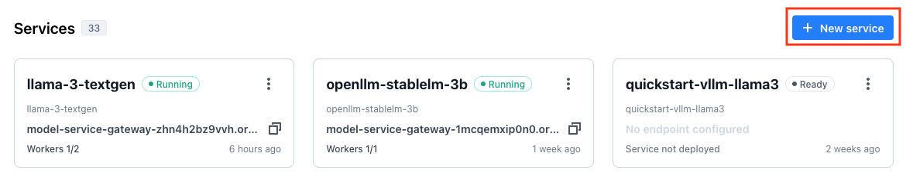

# Deploy Llama 3 model with VESSL Service
This document provides step-by-step instructions for deploying the Llama 3 model using VESSL Service.

## Prerequisites
Before you begin, ensure that you have the following:

- Git
- Python 3
- VESSL account

## Instruction
### 1. Install VESSL CLI and Configure Your Identity
First, install the VESSL CLI tool and configure it with your VESSL account credentials.
```sh
$ pip install --upgrade vessl
$ vessl configure
```
### 2. Clone the Repository
Next, clone the VESSL examples repository and navigate to this directory.
```sh
$ git clone https://github.com/vessl-ai/examples.git
$ cd examples/llama-3-deployment
```

### 3. Create a Model Repository
Create a new model repository in VESSL.
```sh
$ vessl model-repository create llama-3-deployment

Organization: demo
Created 'llama-3-deployment'.
For more info: https://app.vessl.ai/demo/models/llama-3-deployment
```

### 4. Register the Model
Register your model in the model repository you just created.
```sh
$ vessl model register

Organization: demo
Type of model to register (vessl, bento, hf-transformers, hf-diffusers) [vessl]: vessl
[?] Model repository: 
> llama-3-deployment

[?] Generating entrypoint as `vessl model launch service.py:Service -p 3000`. Proceed? (No to input manually) (Y/n): y

[?] Python version? (detected: 3.10): 3.10
[?] Framework type: 
> torch
  tensorflow

[?] PyTorch version? (contact support@vessl.ai if you cannot find expected.): 
> 2.3.0
  2.2.0
  1.14.0

[?] CUDA version?: 
> 12.4
  12.3

[?] Path to requirements file? [detected: requirements.txt] (optional, press Enter to skip): requirements.txt
[?] Model number (optional): 
Generated ignore file.
[?] Register and upload current directory as model? (Y/n): y

Creating a new model.
Created a new model with number 1.
Lockfile saved.
llama-3-deployment-1 /code/examples/llama-3-deployment /
Uploading 4 file(s) (768.0B)...
Total 4 file(s) uploaded.
Registered llama-3-deplyment-1.
```

### 5. Create a Service
Create a new service in the VESSL platform.
1. Go to the VESSL web interface.
2. Click 'New service' on the service panel.

3. Follow the prompts to create a new service.


### 6. Create a YAML File to Configure the Service Revision
Create a YAML configuration file for the service revision. Replace `${API_KEY}` with your own API key.
```sh
$ vessl service create-yaml llama-3-textgen llama-3-deplyment-test --api-key

Service name of llama-3-textgen found.
Using vessl-gcp-oregon cluster configured by the service.
[?] Preset: 
  cpu-small
  cpu-small-spot
  gpu-l4-small
  gpu-l4-small-spot
  gpu-l4-medium
  gpu-l4-medium-spot
  gpu-l4-large
  gpu-l4-large-spot
  gpu-v100-small
> gpu-v100-small-spot

Select API key for authentication.
[?] Secret:
> Create a new secret

[?] Secret name: llama-3-api-key
[?] Secret value: ${API_KEY}
Secret llama-3-api-key created.
service.yaml created.
```

### 7. Create a Service Revision and Deploy
Create a service revision and deploy it with the YAML file you created above.
```sh
$ vessl service create -f service.yaml -a
```
This will deploy the Llama 3 model using the specified configuration in the YAML file.

### 8. Retrieve the Endpoint URL
You can retrieve the URL of the service endpoint with `vessl service read` command.
```sh
$ vessl service read --service llama-3-textgen --format text --detail

 Enabled True
 Status success
 Endpoint model-service-gateway-xxx.oregon.google-cluster.vessl.ai
 Ingress Class nginx
 Annotations (empty)
 Traffic Targets
 - ########## 100%:  1
```

### 9. Test the model deployed
Finally, let's check if the model is deployed correctly with a simple curl command. Replace `${ENDPOINT_URL}` and `${API_KEY}` with the service endpoint URL and API key configured above.
```sh
$ curl -X POST ${ENDPOINT_URL} \
    -H "Content-Type: application/json" \
    -H "X-AUTH-KEY: ${API_KEY}" \
    -d '{
      "messages": [
        {
          "role": "system",
          "content": "You are a pirate chatbot who always responds in pirate speak!"
        },
        {
          "role": "user",
          "content": "Who are you?"
        }
      ]
    }'

{"generated_text":"<|begin_of_text|><|start_header_id|>system<|end_header_id|>\n\nYou are a pirate chatbot who always responds in pirate speak!<|eot_id|><|start_header_id|>user<|end_header_id|>\n\nWho are you?<|eot_id|><|start_header_id|>assistant<|end_header_id|>\n\nArrrr, me hearty! Me name be Captain Chatbot, the scurviest pirate to ever sail the Seven Seas! I be a swashbucklin' chatbot, ready to converse with ye about the latest booty... er, I mean, chat trends! Me treasure trove o' knowledge be filled with the finest pirate phrases and pirate-y puns, so hoist the colors and let's set sail fer a chat, matey!"}
```

For more detailed information and troubleshooting, refer to the [VESSL documentation](https://docs.vessl.ai/) or contact [VESSL support](mailto:support@vessl.ai).
