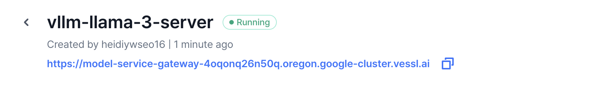
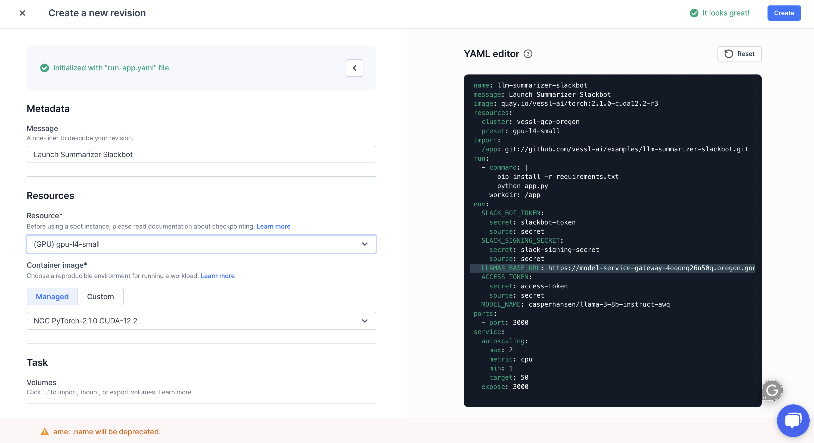

# Deploying a Summarizer Slackbot Using Llama3 and VESSL Service
This is an interactive example on how to build a Summarizer Slackbot using the open-source Llama3 model with VESSL Service. We will guide you step-by-step through the process of creating a server for Llama3 and launching the bot app itself.

## Create the App
On [api.slack.com](https://api.slack.com/), create a new app called 'Summarizer' in your designated workspace. Configure the necessary scopes (such as **app_mentions:read**,**channels:history**, **channels:join**, **chat:write**, **im:history**, **remote_files:read**, **users:read**) under OAuth & Permissions and install the app. 

Take the Signing Secret and Bot User OAuth Token and save them somehwere secure, like the designated VESSL interface (Settings > Secrets)

## Serve Llama3 Using VESSL Service
We will now deploy a Llama3 server with VESSL Service by following these steps.
1. Clone the repository
```bash
   git clone https://github.com/vessl-ai/examples.git
```
2. Make sure VESSL is installed and configured
```bash
   pip install vessl
   vessl configure
```
3. Deploy the server using the provided `serve-llama.yaml` configuration and VESSL CLI using the following command
```bash
   cd examples/llm-summarizer-slackbot
   vessl service create -f serve-llama.yaml --set-current-active
``` 

Once the service is running, you can access the model through the endpoint.


## Serving the App 
To serve the app, create a **New Service** through the VESSL's Services tab. Then, create a **New Revision** and follow these steps:
1. Upload the `run-app.yaml` from the cloned repository. You will see the exact file on the right. You can now directly edit the YAML file or with the UI.

2. Make sure that your secrets are properly configured.
3. Paste in the endpoint produced by the Llama server in `LLAMA3_BASE_URL` and press **Create**.

    Once the revision is running, the app server will produce an endpoint that you can enter into the Slack Request URL under Event Subscriptions.

    **Remember to add '/slack/events' at the end of the endpoint when entering the Request URL for the app to properly respond to Slack events**

4. Subscribe to bot events (such as **app_mention**, **message.channels**, **message.im**) and save the changes. 

The app is now good to go. Mention the bot in a thread and ask it a question or use the `summarize` command for a summary, `--limit` to specify the number of messages (default: 10), `--help` for instructions, and `--version` to check the app version.
