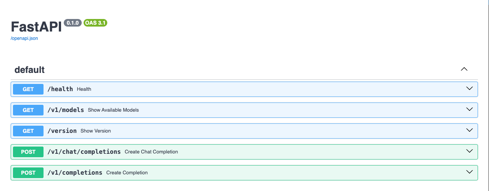
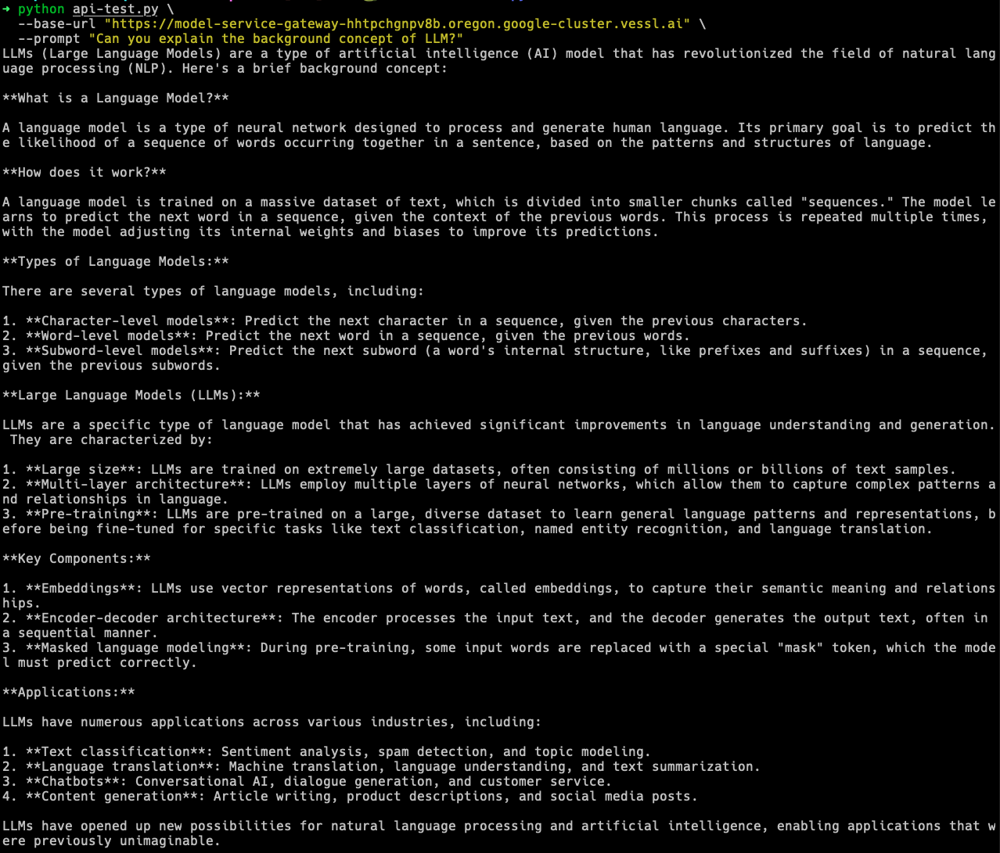

# 1-minute guide to VESSL Serve

This is a 1-minute quickstart for deploying Llama 3 with VESSL Serve. Here, you will set up a text generation API using vLLM acceleration.

## What's included
* `quickstart.yaml` - A YAML configuration that specifies the service details such as computing resources, autoscaling options, and port settings for your API server.
* `api-test.py` - A script to interact with your FastAPI-enabled text generation app which utilizes vLLM-accelerated LLaMA 3.

## Launch the app

Deploy your service with VESSL Serve with a single command. This will create a first revision of your production Llama 3.
```
vessl serve create -f quickstart.yaml
```

Behind the scenes, VESSL Serve facilitates the common logics of model deployment:

* Spin up a GPU-accelerated workload and set up a service environment
* Deploys your model and associated API scripts to the cloud infrastructure.
* Establishes an API server configured to receive inference requests through a dedicated port.

## Using the app
After your service is active, you can access the model with the resulting endpoint.


To explore the API's capabilities, append `/docs` to the endpoint URL and navigate there to interact with the documentation generated by FastAPI.
 


vLLM provides a full compatibility with OpenAI clients. Install the OpenAI Python package if not already installed:

```
pip install openai
```
To interact with your deployed API, utilize the `api-test.py` script. Replace `YOUR-SERVICE-ENDPOINT` with your actual service endpoint and execute the following command to see your app in action:

```
python api-test.py \
  --base-url "https://{YOUR-SERVICE-ENDPOINT}" \
  --prompt "Can you explain the background concept of LLM?"
```



VESSL Serve offloads the complex challenges of deploying custom models while ensuring availability, scalability, and reliability.
* Autoscale the model to handle peak loads and scale to zero when it's not being used
* Routes traffic efficiently across different model versions.
* Provides a real-time monitoring of predictions and performance metrics through comprehensive dashboards and logs.
