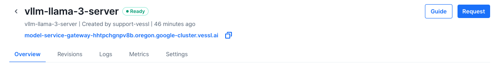
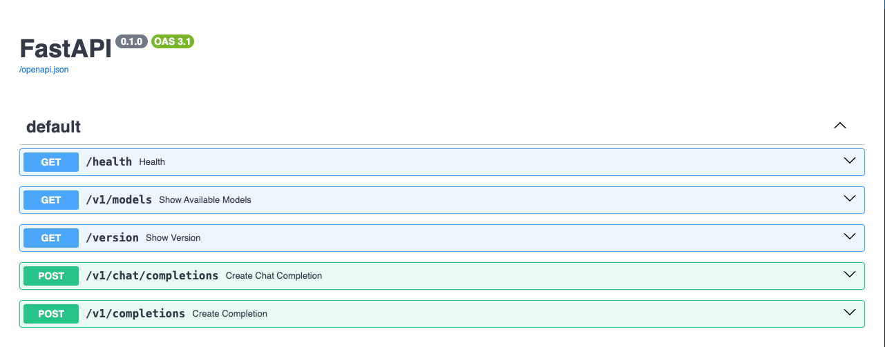
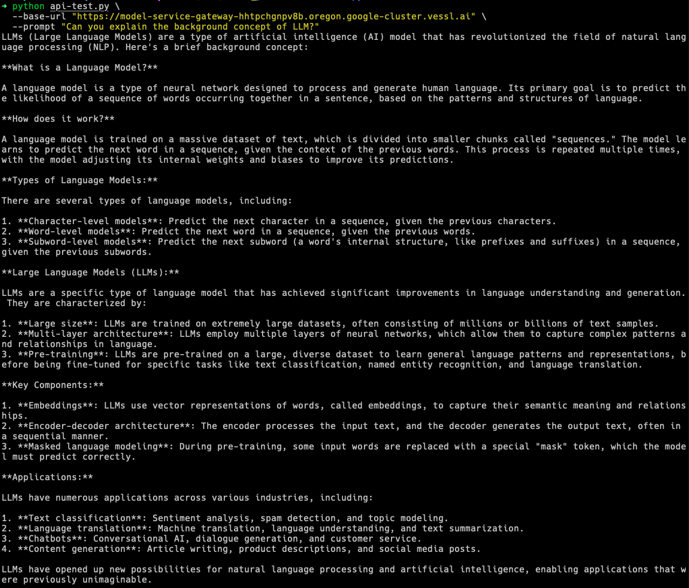
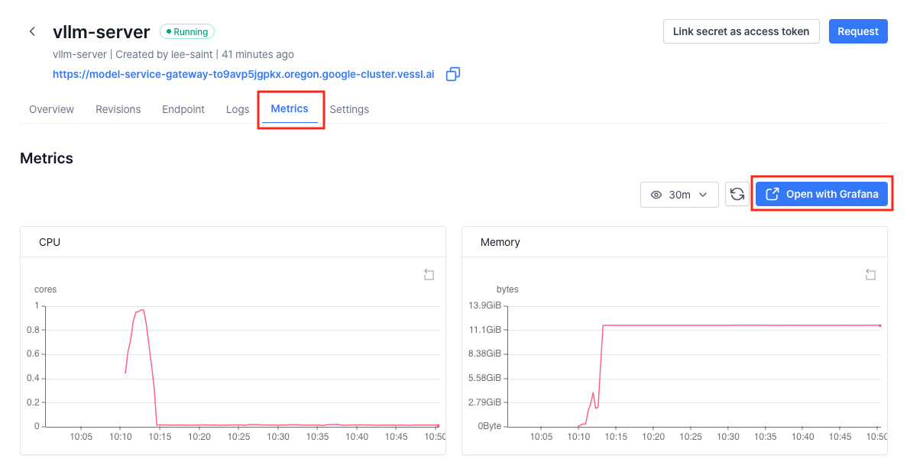
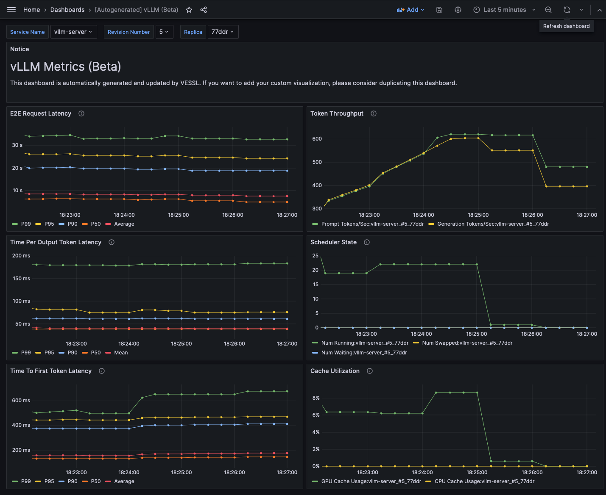

# 1-minute guide to VESSL Service

This is a 1-minute quickstart for deploying Llama 3.1 with VESSL Service. Here, you will set up a text generation API using vLLM acceleration.

## What's included
* `quickstart.yaml` - A YAML configuration that specifies the service details such as computing resources, autoscaling options, and port settings for your API server.
* `api-test.py` - A script to interact with your FastAPI-enabled text generation app.

## Launch the app

Deploy your service with VESSL Service with a single command. This will create a first revision of your production Llama 3.1.
```
vessl service create -f quickstart.yaml
```

Behind the scenes, VESSL Service facilitates the common logics of model deployment:

* Spin up a GPU-accelerated workload and set up a service environment
* Deploys your model and associated API scripts to the cloud infrastructure.
* Establishes an API server configured to receive inference requests through a dedicated port.

## Using the app
After your service is active, you can access the model with the resulting endpoint.



To explore the API's capabilities, append `/docs` to the endpoint URL and navigate there to interact with the documentation generated by FastAPI.
 


vLLM provides a full compatibility with OpenAI clients. Install the OpenAI Python package if not already installed:

```
pip install openai
```
To interact with your deployed API, utilize the `api-test.py` script. Replace `YOUR-SERVICE-ENDPOINT` with your actual service endpoint and execute the following command to see your app in action:

```
python api-test.py \
  --base-url "https://{YOUR-SERVICE-ENDPOINT}" \
  --prompt "Can you explain the background concept of LLM?"
```



VESSL Service offloads the complex challenges of deploying custom models while ensuring availability, scalability, and reliability.
* Autoscale the model to handle peak loads and scale to zero when it's not being used
* Routes traffic efficiently across different model versions.
* Provides a real-time monitoring of predictions and performance metrics through comprehensive dashboards and logs.


## Advanced: Benchmarking the API Server

vLLM provides the capability to collect key metrics necessary for monitoring LLM services based on Prometheus. Examples of metrics provided by the vLLM service include:
* E2E request latency: The time taken to send a request to the API server and receive a response
* Token throughput: The number of tokens processed/generated per second
* Time per first token: The time taken from receiving a request to generating the first token
* Cache utilization: The percentage of data stored in the GPU VRAM's KV cache that is utilized

You can run the benchmark script on your local environment to evaluate the performance of the API server as follows.

```sh
# Install required dependencies
pip install aiohttp

# Clone the vLLM repository (which contains benchmark script)
git clone https://github.com/vllm-project/vllm

# Get sample prompt for benchmarking
wget https://huggingface.co/datasets/anon8231489123/ShareGPT_Vicuna_unfiltered/resolve/main/ShareGPT_V3_unfiltered_cleaned_split.json

# Run the benchmark script
python vllm/benchmarks/benchmark_serving.py \
  --backend vllm \
  --base-url ${API_ENDPOINT_URL} \
  --model hugging-quants/Meta-Llama-3.1-8B-Instruct-AWQ-INT4 \
  --request-rate 3 \
  --dataset-path ShareGPT_V3_unfiltered_cleaned_split.json 
```

Our Prometheus server collects your logs and metrics from the service deployed, based on the `monitoring` configuration in the YAML file. We also provide Grafana, where you can view the metrics. To access the Grafana dashboard, click the **Open with Grafana** button in the Metrics tab:



There is an auto-generated dashboard for vLLM metrics in the Grafana. You can also create your own dashboard with custom metrics. For more details, please refer to [the official vLLM documentation](https://github.com/vllm-project/vllm/tree/main/examples/production_monitoring)!




## Cleaning Up

You can terminate a running Service revision using the `vessl service terminate` command:

```sh
$ vessl service terminate --service ${SERVICE_NAME} -n ${REVISION_NUMBER}

Successfully terminated revision.
```

You can also terminate a revision by clicking **Terminate** button in the Revisions tab of the Web dashboard:


