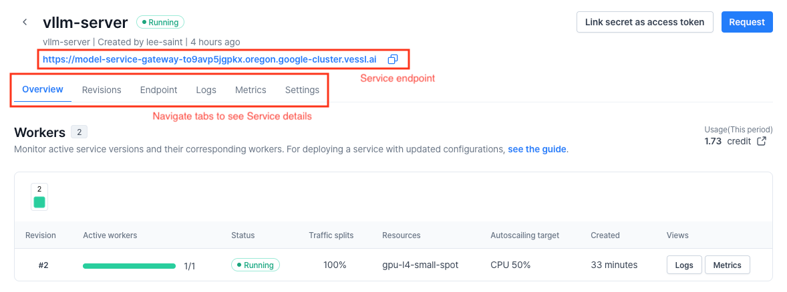
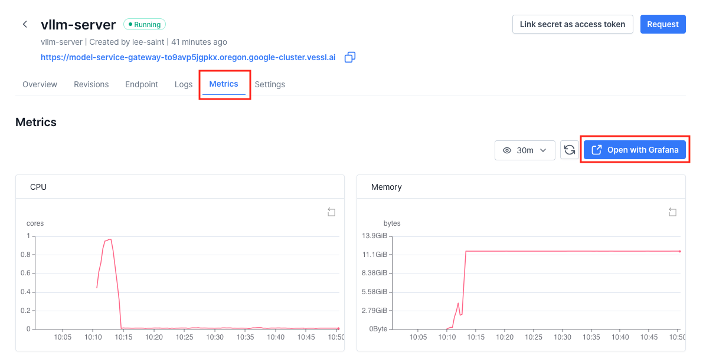
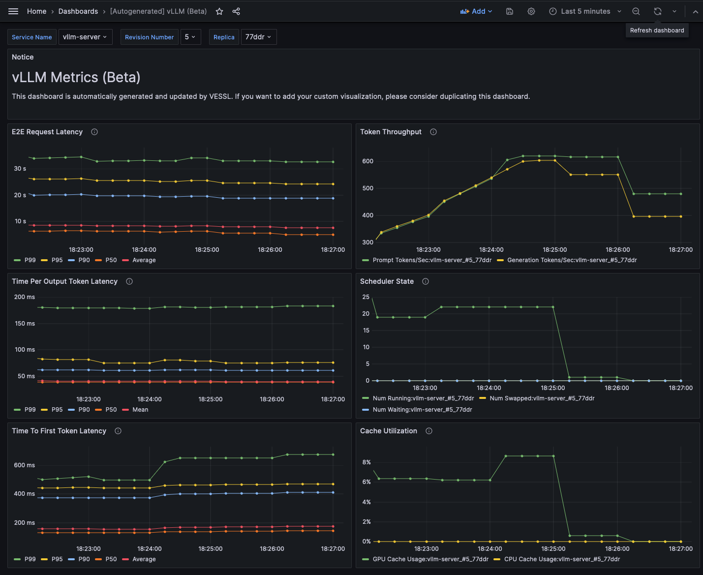

# LLM Inference with vLLM and VESSL Run (한글 문서)
------

[](README.md) [](README-ko.md)

이 문서는 VESSL Service와 vLLM을 이용하여 LLM API를 빠르고 효율적으로 배포하는 방법을 설명합니다.
* [VESSL Service](https://docs.vessl.ai/guides/serve)는 AI 모델을 배포할 수 있는 플랫폼입니다.
* [vLLM](https://vllm.ai/) 은 [PagedAttention](https://arxiv.org/pdf/2309.06180.pdf) 등의 기술을 기반으로 LLM 추론의 성능을 크게 높일 수 있는 라이브러리입니다.

> **Note**:
> * 시작하기 전 CLI 환경에서 아래 커맨드를 실행하여 VESSL에 잘 로그인 되었는지 확인해주세요:
>   ```sh
>   # Check if you are logged in
>   vessl whoami
> 
>   # If not, configure VESSL CLI with your VESSL credentials
>   vessl configure
>   ```

## Deploying vLLM server with VESSL Service

VESSL Service에서 **revision**은 배포의 기본 단위입니다. Revision의 정의에는 코드, 커맨드, AI 모델, 패키지, 환경 변수 등 서비스 배포를 위한 다양한 정보가 포함됩니다. 

Revision의 정의는 YAML 파일로 작성됩니다. 예를 들면, 이번 예제의 YAML 파일 중 일부를 아래와 같이 작성할 수 있습니다.

> `meta-llama/Meta-Llama-3.1-8B-Instruct` 등 사전 승인이 필요한 모델을 사용할 경우, Run 실행 전에 `HF_TOKEN`을 자신의 허깅페이스 API 토큰으로 변경해야 합니다. 허깅페이스 API 토큰을 발급받는 방법에 대해서는 [허깅페이스 공식 문서](https://huggingface.co/docs/api-inference/en/quicktour#get-your-api-token)를 참고해 주시기 바랍니다.
> 본 예시에서는 성능과 접근성을 위해 Llama 3.1 8B를 AWQ 양자화한 모델인 [`hugging-quants/Meta-Llama-3.1-8B-Instruct-AWQ-INT4`](https://huggingface.co/hugging-quants/Meta-Llama-3.1-8B-Instruct-AWQ-INT4)을 사용하였습니다.

```yaml
# service.yaml
name: vllm-server
message: LLM server with vLLM
resources: # Resource requirements
  cluster: vessl-gcp-oregon
  preset: gpu-l4-small-spot
image: quay.io/vessl-ai/torch:2.3.1-cuda12.1-r5 # Container image
import: # Code, data, or model to import
  /code/:
    git:
      url: github.com/vessl-ai/examples.git
      ref: main
run:
  - command: |- # Command to run the API server
      ...
ports: # Endpoint configuration
  - name: vllm
    type: http
    port: 8000
service:
  autoscaling: # Auto-scaling configuration
    ...
  expose: 8000 # Port number to expose to public
  monitoring: # Monitoring configuration
    - port: 8000
      path: /metrics
env: # Environment variables
  MODEL_NAME: hugging-quants/Meta-Llama-3.1-8B-Instruct-AWQ-INT4
  HF_TOKEN: HF_TOKEN # Your Huggingface API token
```

[service.yaml](service.yaml) 파일에는 아래 내용들이 정의되어 있습니다:
* 사용할 리소스 및 컨테이너 이미지
* 코드를 가져오기 위한 git repository 정보
* vLLM 기반의 LLM API 서버를 실행하기 위한 커맨드
* API 서버에 연결하기 위한 설정
* 오토스케일링과 모니터링 설정

위 YAML 파일을 가지고 revision을 생성 및 실행하기 위해서는 `vessl service create` 명령어를 사용하시면 됩니다.

```sh
$ vessl service create -f service.yaml --launch
```

Service revision을 생성하는 방법에 대한 더 자세한 내용은 [공식 문서](https://docs.vessl.ai/guides/serve/create-a-service)를 참고해 주세요!

## Accessing VESSL Service with Web Dashboard 

Service revision이 생성된 후, CLI 환경에서 아래와 같이 Web Dashboard의 링크를 확인할 수 있습니다.


대시보드에서는 엔드포인트 주소 등 Service의 자세한 정보를 확인하실 수 있습니다.



## Testing the API

Service Dashboard에서 엔드포인트 주소(`API_ENDPOINT_URL`)를 클립보드에 복사할 수 있습니다. 간단한 파이썬 스크립트([`api-test.py`](api-test.py))를 이용하여 API 서버가 잘 작동하는지 확인해 봅시다.

```sh
$ python vllm-run/api-test.py \
    --base-url ${API_ENDPOINT_URL} \
    --model-name hugging-quants/Meta-Llama-3.1-8B-Instruct-AWQ-INT4

ChatCompletionMessage(content='The capital of South Korea is Seoul.', role='assistant', function_call=None, tool_calls=[])
```

## Advanced: Benchmarking API server

`vLLM` 은 Prometheus 기반으로 LLM 서비스의 모니터링에 필요한 주요 지표들을 수집할 수 있는 기능을 제공합니다. vLLM 서비스가 제공하는 지표들의 예시는 다음과 같습니다.
* E2E request latency: API 서버에 요청을 보내고 응답을 받는데 걸리는 시간
* Token throughput: 초당 처리/생성하는 토큰의 수
* Time per first token: 요청을 받아 첫 번째 토큰을 생성하는데 걸리는 시간
* Cache utilization: GPU VRAM 내의 KV cache에 저장된 데이터를 사용하는 비율

로컬 환경에서 아래와 같이 벤치마킹 스크립트를 실행하여 API 서버의 성능을 확인할 수 있습니다.

```sh
# Install required dependencies
pip install aiohttp

# Clone the vLLM repository (which contains benchmark script)
git clone https://github.com/vllm-project/vllm

# Get sample prompt for benchmarking
wget https://huggingface.co/datasets/anon8231489123/ShareGPT_Vicuna_unfiltered/resolve/main/ShareGPT_V3_unfiltered_cleaned_split.json

# Run the benchmark script
python vllm/benchmarks/benchmark_serving.py \
  --backend vllm \
  --base-url ${API_ENDPOINT_URL} \
  --model hugging-quants/Meta-Llama-3.1-8B-Instruct-AWQ-INT4 \
  --request-rate 3 \
  --dataset-path ShareGPT_V3_unfiltered_cleaned_split.json 
```

클러스터에 배포되어 있는 Prometheus 서버가 YAML 파일의 `monitoring` 설정에 따라 서비스의 로그와 지표를 수집하고 있습니다. 또한 Prometheus에서 수집한 지표를 확인할 수 있는 Grafana 대시보드가 제공됩니다. Grafana 대시보드에 접근하기 위해서는, Metrics 탭의 **Open with Grafana** 버튼을 클릭합니다.



Grafana에는 자동 생성된 vLLM 지표용 대시보드가 있습니다. 물론 개인화된 메트릭을 사용하여 직접 대시보드를 만드는 것도 가능합니다. 더 자세한 내용은 [vLLM 공식 문서](https://github.com/vllm-project/vllm/tree/main/examples/production_monitoring)를 참고해 주세요!




## Cleaning up

`vessl service terminate` 커맨드를 사용하여 실행 중인 Service revision을 종료할 수 있습니다.

```sh
$ vessl service terminate --service ${SERVICE_NAME} -n ${REVISION_NUMBER}

Successfully terminated revision.
```

Web dashboard의 Revisions 탭에서 **Terminate** 버튼을 클릭해도 revision을 종료할 수 있습니다.


## Citation

```bibtex
@inproceedings{kwon2023efficient,
  title={Efficient Memory Management for Large Language Model Serving with PagedAttention},
  author={Woosuk Kwon and Zhuohan Li and Siyuan Zhuang and Ying Sheng and Lianmin Zheng and Cody Hao Yu and Joseph E. Gonzalez and Hao Zhang and Ion Stoica},
  booktitle={Proceedings of the ACM SIGOPS 29th Symposium on Operating Systems Principles},
  year={2023}
}
```
