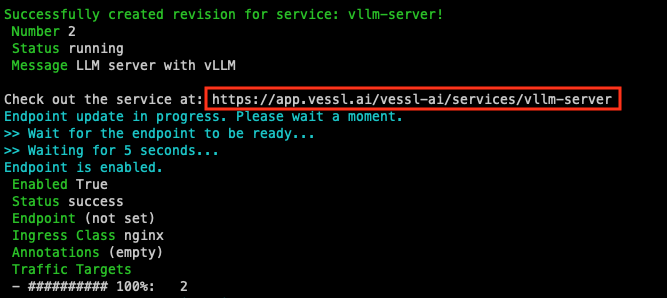
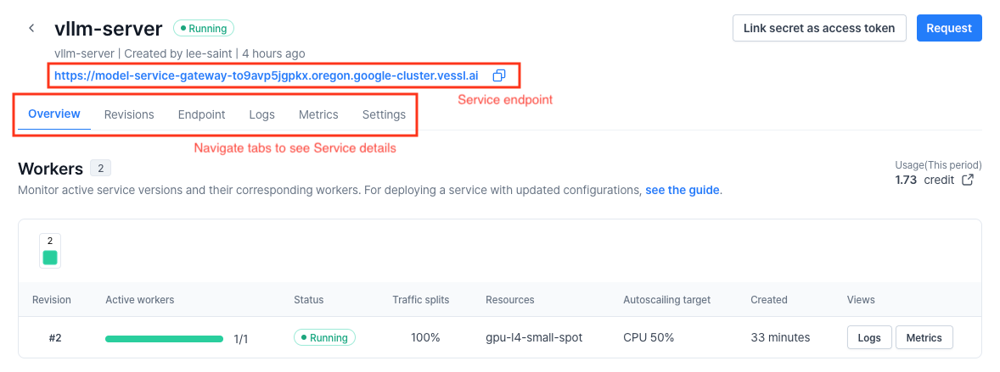
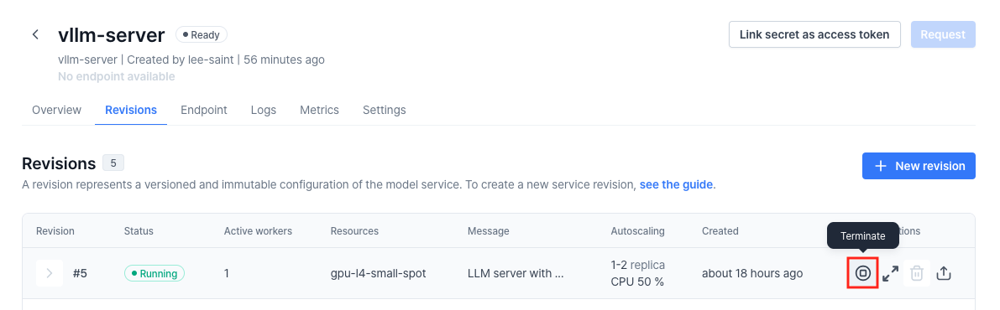

# Online Serving with vLLM and VESSL Service

[](README.md) [](README-ko.md)

This document outlines how to deploy a fast and efficient LLM API using VESSL Service and vLLM.
* [VESSL Service](https://docs.vessl.ai/guides/serve) is a platform that enables easy deployment of AI models.
* [vLLM](https://vllm.ai/) is a library enhancing LLM inference performance, based on technologies like [PagedAttention](https://arxiv.org/pdf/2309.06180.pdf).

> **Note**:
> * Before starting, ensure you're logged into VESSL by running the following commands in the CLI environment:
>   ```sh
>   # Check if you are logged in
>   vessl whoami
> 
>   # If not, configure VESSL CLI with your VESSL credentials
>   vessl configure
>   ```

## Deploying vLLM Server with VESSL Service

**Revision** is the basic unit for deployment in VESSL Service. A Service revision's definition includes various details needed to deploy a Service such as code, commands, AI models, packages, environment variables, etc.


The definition of a Service revision is written in a YAML file. For instance, here is a snippet of the YAML file for this example:

> **Note:** If you want to use a gated model such as `meta-llama/Meta-Llama-3.1-8B-Instruct`, you have to replace `HF_TOKEN` with your own Huggingface API token. Please refer to the [Huggingface official document](https://huggingface.co/docs/api-inference/en/quicktour#get-your-api-token) if you don't know how to get an API token.
> In this example, [`hugging-quants/Meta-Llama-3.1-8B-Instruct-AWQ-INT4`](https://huggingface.co/hugging-quants/Meta-Llama-3.1-8B-Instruct-AWQ-INT4), a quantized Llama 3.1 8B model is used for perfomance and accessibility.

```yaml
# service.yaml
name: vllm-server
message: LLM server with vLLM
resources: # Resource requirements
  cluster: vessl-gcp-oregon
  preset: gpu-l4-small-spot
image: quay.io/vessl-ai/torch:2.3.1-cuda12.1-r5 # Container image
import: # Code, data, or model to import
  /code/:
    git:
      url: github.com/vessl-ai/examples.git
      ref: main
run:
  - command: |- # Command to run the API server
      ...
ports: # Endpoint configuration
  - name: vllm
    type: http
    port: 8000
service:
  autoscaling: # Auto-scaling configuration
    ...
  expose: 8000 # Port number to expose to public
  monitoring: # Monitoring configuration
    - port: 8000
      path: /metrics
env: # Environment variables
  MODEL_NAME: hugging-quants/Meta-Llama-3.1-8B-Instruct-AWQ-INT4
  HF_TOKEN: HF_TOKEN # Your Huggingface API token
```
This [service.yaml](./service.yaml) file defines the following:
* The resources and container image to be used
* Git repository information for importing code
* Commands to run a vLLM-based LLM API server
* Configuration to connect the API server
* Configurations for auto-scaling and monitoring

To create a revision, Use `vessl service create` command with the YAML file.

```sh
vessl service create -f service.yaml --launch
```

Executing the above command will create and launch a Service revision.

For detailed instructions on creating a Service revision, please refer to the [documentation](https://docs.vessl.ai/guides/serve/create-a-service).

## Accessing VESSL Service with Web Dashboard

After a Service revision is created, you can find the link to the Web Dashboard in the CLI environment as shown below:



The dashboard allows you to view detailed information about the Service, including the service endpoint.



## Testing the API

Copy the endpoint address (`API_ENDPOINT_URL`) in the Service Dashboard. You can run a simple python script([`api-test.py`](api-test.py)) to test if the API server is operating correctly.

```sh
$ python services/vllm/api-test.py \
    --base-url ${API_ENDPOINT_URL} \
    --model-name hugging-quants/Meta-Llama-3.1-8B-Instruct-AWQ-INT4

ChatCompletionMessage(content='The capital of South Korea is Seoul.', role='assistant', function_call=None, tool_calls=[])
```

## Advanced: Benchmarking the API Server

`vLLM` provides the capability to collect key metrics necessary for monitoring LLM services based on Prometheus. Examples of metrics provided by the vLLM service include:
* E2E request latency: The time taken to send a request to the API server and receive a response
* Token throughput: The number of tokens processed/generated per second
* Time per first token: The time taken from receiving a request to generating the first token
* Cache utilization: The percentage of data stored in the GPU VRAM's KV cache that is utilized

You can run the benchmark script on your local environment to evaluate the performance of the API server as follows.

```sh
# Install required dependencies
pip install aiohttp

# Clone the vLLM repository (which contains benchmark script)
git clone https://github.com/vllm-project/vllm

# Get sample prompt for benchmarking
wget https://huggingface.co/datasets/anon8231489123/ShareGPT_Vicuna_unfiltered/resolve/main/ShareGPT_V3_unfiltered_cleaned_split.json

# Run the benchmark script
python vllm/benchmarks/benchmark_serving.py \
  --backend vllm \
  --base-url ${API_ENDPOINT_URL} \
  --model hugging-quants/Meta-Llama-3.1-8B-Instruct-AWQ-INT4 \
  --request-rate 3 \
  --dataset-path ShareGPT_V3_unfiltered_cleaned_split.json 
```

Our Prometheus server collects your logs and metrics from the service deployed, based on the `monitoring` configuration in the YAML file. We also provide Grafana, where you can view the metrics. To access the Grafana dashboard, click the **Open with Grafana** button in the Metrics tab:


There is an auto-generated dashboard for vLLM metrics in the Grafana. You can also create your own dashboard with custom metrics. For more details, please refer to [the official vLLM documentation](https://github.com/vllm-project/vllm/tree/main/examples/production_monitoring)!


## Cleaning Up

You can terminate a running Service revision using the `vessl service terminate` command:

```sh
$ vessl service terminate --service ${SERVICE_NAME} -n ${REVISION_NUMBER}

Successfully terminated revision.
```

You can also terminate a revision by clicking **Terminate** button in the Revisions tab of the Web dashboard:



## Citation

```bibtex
@inproceedings{kwon2023efficient,
  title={Efficient Memory Management for Large Language Model Serving with PagedAttention},
  author={Woosuk Kwon and Zhuohan Li and Siyuan Zhuang and Ying Sheng and Lianmin Zheng and Cody Hao Yu and Joseph E. Gonzalez and Hao Zhang and Ion Stoica},
  booktitle={Proceedings of the ACM SIGOPS 29th Symposium on Operating Systems Principles},
  year={2023}
}
```
