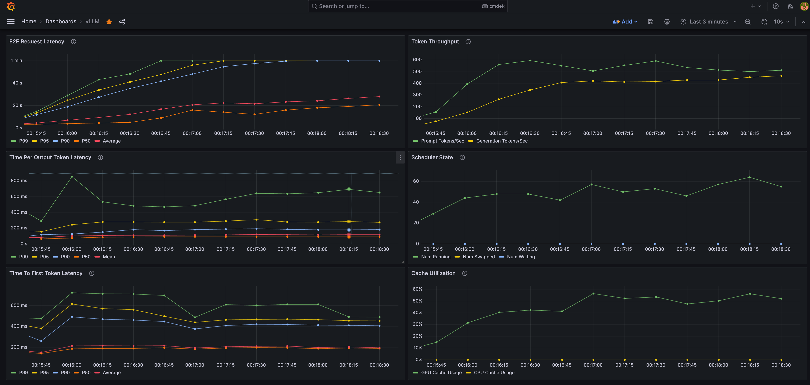
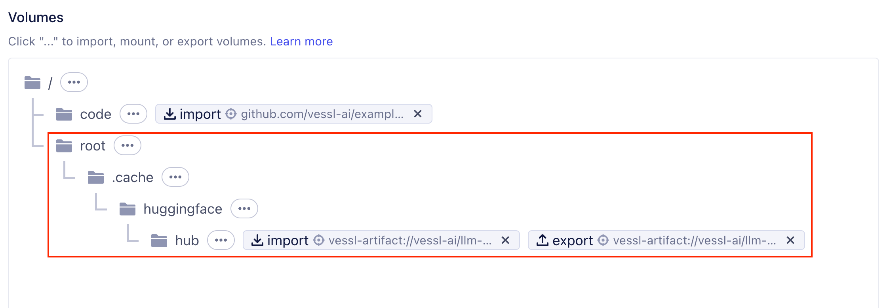

# Online Serving with vLLM and VESSL Run
------

이 문서는 VESSL Run과 vLLM을 이용하여 LLM을 더 빠르게 추론할 수 있는 모델 API를 만드는 방법을 설명합니다.
* [VESSL Run](https://run-docs.vessl.ai/) 은 AI 모델을 빠르게 빌드하고 배포할 수 있는 플랫폼입니다.
* [vLLM](https://vllm.ai/) 은 [PagedAttention](https://arxiv.org/pdf/2309.06180.pdf) 등의 기술을 기반으로 LLM 추론의 성능을 크게 높일 수 있는 라이브러리입니다.



> **Note**: VESSL Run은 단일 컨테이너에서 노트북, 학습, 추론 서비스 등을 실행하기 위한 기능입니다. Autoscaling이나 Load Balancing 등 Production-level AI 서비스에 필요한 기능을 함께 사용하기 위해서는 [VESSL Serve](https://docs.vessl.ai/user-guide/serve)를 참고해주세요.


## Deploying vLLM server with VESSL Run

## Connecting 

## Testing the API

## Benchmarking API server

## Advanced Topics for Faster 

### Build a custom Docker image for faster Run turn-up

Run을 실행하는 과정에서 Prometheus와 vLLM 설치 등 초기화 작업을 수행하는 것을 로그에서 확인하실 수 있습니다. 이러한 초기화 작업을 Docker 이미지에 포함시켜서 Run을 더 빠르게 실행할 수 있습니다.

아래는 각종 dependency를 포함한 Docker 이미지를 빌드하는 예시입니다.

```Dockerfile
FROM quay.io/vessl-ai/torch:2.2.0-cuda12.3-r3

ENV PROMETHEUS_VERSION=2.49.1

WORKDIR /app

# Download and unzip prometheus binary to /app/prometheus
RUN wget https://github.com/prometheus/prometheus/releases/download/v$PROMETHEUS_VERSION/prometheus-$PROMETHEUS_VERSION.linux-amd64.tar.gz
RUN tar -xvf prometheus-$PROMETHEUS_VERSION.linux-amd64.tar.gz
RUN mv prometheus-$PROMETHEUS_VERSION.linux-amd64 ./prometheus
RUN rm prometheus-$PROMETHEUS_VERSION.linux-amd64.tar.gz

# Copy prometheus.yml
COPY monitoring/prometheus.yml /app/prometheus/prometheus.yml

# Install dependencies
COPY requirements.txt /app/requirements.txt
RUN pip install -r /app/requirements.txt

# Entrypoint
ENTRYPOINT ["python", "-m", "api.py"]
```

### Caching `~/.cache/huggingface/hub` for faster model loading

예제에서는 HuggingFace의 모델을 사용하고 있습니다. HuggingFace의 모델은 처음 로딩할 때 다운로드를 받아야 하기 때문에, 처음 로딩하는데 시간이 소요됩니다. 이러한 시간을 줄이기 위해서 `~/.cache/huggingface/hub` 디렉토리를 미리 캐싱해둘 수 있습니다.

VESSL Artifacts를 사용하여 아래와 같이 `~/.cache/huggingface/hub` 디렉토리를 캐싱할 수 있습니다. Run이 종료될 때 해당 디렉토리를 Artifacts로 저장하고, 다음 Run에서는 Artifacts를 다시 불러와서 사용할 수 있습니다.



YAML manifest에서는 `import` 와 `export` 영역이 아래와 같이 추가됩니다.

```yaml
import:
  ...
  /root/.cache/huggingface/hub/: vessl-artifact://{ORGANIZATION}/{PROJECT}/huggingface-models
export:
  /root/.cache/huggingface/hub/: vessl-artifact://{ORGANIZATION}/{PROJECT}/huggingface-models

```
